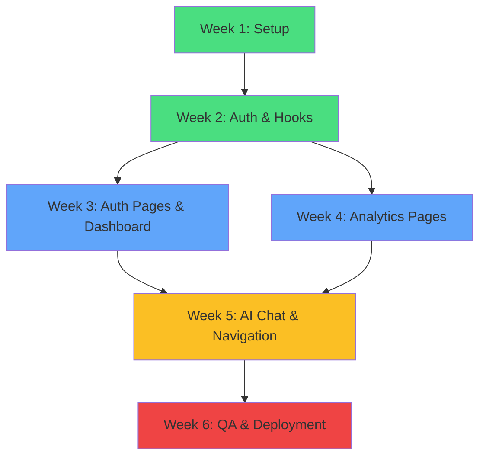

# Gajian Aman Frontend — Development Roadmap & Sequencing

**Purpose:** Week-by-week development plan with milestones, dependencies, and risk mitigation.

---

## Overview

**Total Duration:** 5–6 weeks (40–50 engineering hours)  
**Team Size:** 1 frontend engineer  
**Dependencies:**
- Supabase project live with PostgreSQL database
- Vercel account ready for deployment
- Python backend (Telegram bot) deployed for testing

---

## Week 1: Foundation & Core Setup

### Goals
✅ Project fully initialized and building  
✅ TypeScript types defined  
✅ Styling system in place  
✅ Basic layout structure ready

### Daily Breakdown

**Day 1: Project Initialization**
- [ ] Create `frontend/` directory, initialize Vite + React + TypeScript
- [ ] Install all dependencies (Tailwind, shadcn/ui, Supabase, etc.)
- [ ] Configure Vite with Tailwind plugin, path alias
- [ ] Set up `.env`, `.env.local`, `.env.example`
- [ ] Verify `npm run dev` works
- **Time:** 2 hours | **Deliverable:** Project builds without errors

**Day 2: Type System & Configuration**
- [ ] Create `lib/supabase.ts` with all domain types (User, Transaction, Budget, Goal, etc.)
- [ ] Copy `tailwind.config.ts` from spec
- [ ] Copy `postcss.config.cjs`
- [ ] Create styling structure: `globals.css`, `theme.css`, `fonts.css`, `animations.css`
- [ ] Import fonts (Inter, DM Mono)
- [ ] Verify all CSS variables in DevTools
- **Time:** 3 hours | **Deliverable:** Type system complete, theme tokens working

**Day 3: Core Components**
- [ ] Install shadcn/ui components (button, card, input, select, dialog, badge, progress, etc.)
- [ ] Create `LoadingSpinner.tsx` with Motion animation
- [ ] Create `ProtectedRoute.tsx` wrapper
- [ ] Create `Layout.tsx` with Outlet and BottomNav placeholder
- [ ] Verify no TypeScript errors
- **Time:** 2 hours | **Deliverable:** Core layout structure ready

**Day 4: Library Setup & Utils**
- [ ] Create `lib/utils.ts` with `cn()` helper
- [ ] Create `lib/constants.ts` with category enums, color mappings
- [ ] Initialize Supabase client in `lib/supabase.ts`
- [ ] Test Supabase connection
- [ ] Create directory tree for pages/hooks/components
- **Time:** 1 hour | **Deliverable:** All utilities and client ready

**Day 5: Buffer & Testing**
- [ ] Run full type check: `npm run type-check`
- [ ] Verify Tailwind classes work (add test element with all token classes)
- [ ] Test Supabase client connection (query users table)
- [ ] Document any setup issues
- **Time:** 1 hour | **Deliverable:** All systems verified

### Week 1 Risks & Mitigations

| Risk | Mitigation |
|------|-----------|
| Tailwind v4 compatibility issues | Use official `@tailwindcss/vite` plugin, test early |
| Supabase connection fails | Test with simple query in browser console |
| Font loading problems | Use CSS `@import` or ensure URLs correct in fonts.css |
| TypeScript strict mode too strict | Use `as unknown as Type` sparingly, improve types instead |

### Week 1 Deliverables
- ✅ Repository structure complete
- ✅ All types defined and exported
- ✅ Tailwind + design tokens configured
- ✅ Core layout components created
- ✅ Zero TypeScript errors
- ✅ Supabase client ready to use

---

## Week 2: Authentication & State Management

### Goals
✅ Full auth flow implemented (Telegram, Google, linking)  
✅ All hooks created and tested  
✅ Session persistence working  
✅ Real-time subscriptions established

### Daily Breakdown

**Day 1: useAuth Hook**
- [ ] Implement `useAuth.tsx`:
  - [ ] `loginWithTelegram(id)` — query users table
  - [ ] `loginWithGoogle()` — Supabase OAuth
  - [ ] `logout()` — clear session
  - [ ] Session persistence in localStorage
  - [ ] Loading/error states
- [ ] Create `AuthProvider` context wrapper
- [ ] Test with mock data (don't need real Telegram user yet)
- **Time:** 3 hours | **Deliverable:** useAuth complete with tests

**Day 2: useTransactions Hook**
- [ ] Implement `useTransactions.ts`:
  - [ ] `fetchTransactions(filter)` with month/year/category/type
  - [ ] `addTransaction(input)` — insert + refetch
  - [ ] `updateTransaction(id, input)` — update + refetch
  - [ ] `deleteTransaction(id)` — delete + refetch
  - [ ] Caching to prevent duplicate fetches
  - [ ] Real-time subscription with `supabase.channel()`
- [ ] Compute `dailyAggregates` from transactions
- [ ] Test with sample data
- **Time:** 3 hours | **Deliverable:** useTransactions complete, real-time working

**Day 3: useBudgets & useGoals Hooks**
- [ ] Implement `useBudgets.ts`:
  - [ ] `fetchBudgets(month, year)`
  - [ ] `upsertBudget(category, amount)`
  - [ ] Compute `BudgetWithProgress`
- [ ] Implement `useGoals.ts`:
  - [ ] `fetchGoals()`
  - [ ] `addGoal(name, target, deadline)`
  - [ ] `updateGoal(id, input)`
  - [ ] Compute `GoalWithProgress`
- [ ] Test CRUD operations
- **Time:** 2 hours | **Deliverable:** Budget & goal hooks ready

**Day 4: useMonthFilter Context**
- [ ] Implement `useMonthFilter.tsx`:
  - [ ] Global month/year state
  - [ ] `setMonth()`, `setYear()` methods
  - [ ] Compute `dateRange` (start/end of month)
  - [ ] Provider wraps App
- [ ] Test: change month in one component → all update
- **Time:** 1 hour | **Deliverable:** Context working

**Day 5: Integration & Testing**
- [ ] Wrap App with providers:
  - [ ] AuthProvider
  - [ ] MonthFilterProvider
  - [ ] Sonner Toaster
- [ ] Test multi-hook interactions:
  - [ ] Login → useAuth returns user
  - [ ] Fetch transactions → useTransactions filters by month
  - [ ] Change month → all components update
- [ ] Verify real-time subscriptions active (check browser DevTools console)
- **Time:** 2 hours | **Deliverable:** All providers integrated and tested

### Week 2 Risks & Mitigations

| Risk | Mitigation |
|------|-----------|
| Supabase real-time subscriptions not connecting | Check `channel()` name, ensure RLS policies allow reads |
| useAuth hook prevents app rendering | Add loading state fallback, don't block initial render |
| Session lost on refresh | Test localStorage persistence manually |
| Multiple API calls for same data | Add simple cache layer (e.g., `lastFetchTime`) |

### Week 2 Deliverables
- ✅ All hooks implemented and tested
- ✅ Auth flow: login methods, session persistence
- ✅ Real-time subscriptions working
- ✅ No console errors
- ✅ Data flows through contexts correctly

---

## Week 3: Authentication Pages & Dashboard

### Goals
✅ Login, AuthCallback, LinkTelegram pages complete  
✅ Home dashboard with data displays  
✅ Compound components (TransactionRow, BudgetCard, GoalCard)  
✅ FAB and basic modal working

### Daily Breakdown

**Day 1: Login Page**
- [ ] Create `pages/Login.tsx`:
  - [ ] Telegram ID input (numeric validation)
  - [ ] Google OAuth button
  - [ ] Error/success messages
  - [ ] Redirect on success
  - [ ] Already logged in → skip to home
- [ ] Styling: mobile-first, centered
- [ ] Test both login methods
- **Time:** 2 hours | **Deliverable:** Login page functional

**Day 2: OAuth Callback & Linking**
- [ ] Create `pages/AuthCallback.tsx`:
  - [ ] Listen to Supabase auth state
  - [ ] Handle OAuth callback
  - [ ] Redirect appropriately
- [ ] Create `pages/LinkTelegram.tsx`:
  - [ ] Link Google user to Telegram ID
  - [ ] Validation and error handling
- [ ] Test: Google OAuth → redirect → link → home
- **Time:** 2 hours | **Deliverable:** Full auth flow end-to-end

**Day 3: Compound Components**
- [ ] Create `components/CompoundComponents.tsx`:
  - [ ] `<TransactionRow>` — category, amount, date, interactive
  - [ ] `<BudgetCard>` — progress, warning colors
  - [ ] `<GoalCard>` — progress, deadline
  - [ ] `<CategoryPieChart>` — recharts wrapper
- [ ] Styling with Tailwind tokens
- [ ] Props: variant, onClick, data
- [ ] Test rendering with sample data
- **Time:** 2 hours | **Deliverable:** All compounds ready for pages

**Day 4: Home Dashboard**
- [ ] Create `pages/Home.tsx`:
  - [ ] Month selector in sticky header
  - [ ] 3 summary cards (income, expense, balance)
  - [ ] Daily bar chart (recharts BarChart)
  - [ ] Category pie chart (donut style)
  - [ ] Recent transactions (5 rows)
  - [ ] FAB + placeholder for modal
- [ ] Data binding:
  - [ ] useTransactions + useMonthFilter
  - [ ] Compute totals and aggregates
  - [ ] Charts display correctly
- [ ] Test: month change → all data updates
- **Time:** 2 hours | **Deliverable:** Dashboard displays data correctly

**Day 5: Transaction Modal & Form**
- [ ] Create `components/TransactionModal.tsx`:
  - [ ] Modal backdrop + slide-up animation (Motion)
  - [ ] Close button, callbacks
- [ ] Create transaction form with validation:
  - [ ] AmountInput (format, validate)
  - [ ] Type selector (buttons)
  - [ ] CategorySelect (filtered by type)
  - [ ] Note input (min/max chars)
  - [ ] Date picker
  - [ ] Submit validation
- [ ] Test: modal open/close, form submit
- **Time:** 2 hours | **Deliverable:** Modal + form working

### Week 3 Risks & Mitigations

| Risk | Mitigation |
|------|-----------|
| Charts don't render | Verify recharts installed, data structure correct |
| Modal animation janky | Test on real device, adjust Motion parameters |
| Form validation errors confusing | Clear error messages, highlight invalid fields |
| FAB positioning wrong on notch devices | Test on real iOS with notch |

### Week 3 Deliverables
- ✅ Full auth flow: login → callback → linking
- ✅ Home dashboard displaying real data
- ✅ Charts rendering correctly
- ✅ Transaction modal + form ready to add transactions
- ✅ Mobile layout optimized

---

## Week 4: Analytics & Data Pages

### Goals
✅ Pengeluaran (spending breakdown) complete  
✅ Tren (3-month trends) complete  
✅ Budget page with progress tracking  
✅ Goals page with deadline tracking

### Daily Breakdown

**Day 1: Pengeluaran Page**
- [ ] Create `pages/Pengeluaran.tsx`:
  - [ ] Category filter buttons (All + each type)
  - [ ] BudgetCard-style cards for each category showing total
  - [ ] Transaction list filtered by selected category
  - [ ] Sorting (amount, date)
- [ ] Data: useTransactions + categoryAggregates
- [ ] Test: filter by category → list updates
- **Time:** 2 hours | **Deliverable:** Spending breakdown page functional

**Day 2: Tren (Trends) Page**
- [ ] Create `pages/Tren.tsx`:
  - [ ] Fetch last 3 months of transactions
  - [ ] Line chart: income, expense, net over 3 months
  - [ ] Summary stats: avg, max, trend
  - [ ] Top categories table
  - [ ] Month range selector
- [ ] Charts: recharts LineChart
- [ ] Test: change range → chart updates
- **Time:** 2 hours | **Deliverable:** Trends page with charts

**Day 3: Budget Page**
- [ ] Create `pages/Budget.tsx`:
  - [ ] Add Budget button → modal (category + amount)
  - [ ] BudgetCard for each active budget
  - [ ] Progress bar, warning colors
  - [ ] Over-budget indicator
- [ ] Data: useBudgets + compute BudgetWithProgress
- [ ] Add budget functionality
- [ ] Test: add budget → card appears → progress correct
- **Time:** 2 hours | **Deliverable:** Budget tracking functional

**Day 4: Goals Page**
- [ ] Create `pages/Goals.tsx`:
  - [ ] Add Goal button → modal (name, target, deadline)
  - [ ] GoalCard for each goal
  - [ ] Progress %, days remaining
  - [ ] Edit/delete (optional)
- [ ] Data: useGoals + compute GoalWithProgress
- [ ] Test: add goal → appears → countdown works
- **Time:** 2 hours | **Deliverable:** Goals page functional

**Day 5: Settings & Refinement**
- [ ] Create `pages/Settings.tsx`:
  - [ ] User info display
  - [ ] Currency/timezone selection
  - [ ] Logout button
- [ ] Polish all pages:
  - [ ] Verify responsive on 375px
  - [ ] Check spacing and alignment
  - [ ] Fix any console errors
- [ ] Test all pages for data correctness
- **Time:** 2 hours | **Deliverable:** All analytics pages complete

### Week 4 Risks & Mitigations

| Risk | Mitigation |
|------|-----------|
| Chart data misaligned | Verify date calculations, test with known data |
| Budget spending doesn't match transactions | Check transaction type filtering logic |
| Goal deadline calculation wrong | Test with various date ranges |
| Pages slow on large datasets | Add pagination or virtualization if needed |

### Week 4 Deliverables
- ✅ All 4 analytics pages complete
- ✅ Charts displaying correctly
- ✅ CRUD operations for budgets and goals
- ✅ Data calculations verified
- ✅ Responsive on mobile

---

## Week 5: AI Chat & Navigation

### Goals
✅ AI Chat page with multi-turn conversations  
✅ Image parsing integration  
✅ Bottom navigation complete  
✅ Routing wired end-to-end

### Daily Breakdown

**Day 1: useImageParser Hook**
- [ ] Create `hooks/useImageParser.ts`:
  - [ ] Call `frontend/api/parse-image.js` endpoint
  - [ ] Base64 encode image
  - [ ] Handle response JSON
  - [ ] Error handling
- [ ] Test: upload valid image → parsed result
- **Time:** 1 hour | **Deliverable:** Image parsing hook ready

**Day 2: AI Chat Page**
- [ ] Create `pages/AiChat.tsx`:
  - [ ] Message list (user right, assistant left)
  - [ ] Text input + send button
  - [ ] Image upload button
  - [ ] Typing indicator during processing
  - [ ] Suggested action buttons
  - [ ] Clear conversation button
- [ ] Handle user messages → Claude API calls
- [ ] Handle image uploads → parse-image.js
- [ ] Test: send text → response, upload image → parsed
- **Time:** 3 hours | **Deliverable:** Chat page interactive

**Day 3: Bottom Navigation & Routing**
- [ ] Complete `components/Layout.tsx` → `<BottomNav>`:
  - [ ] 5 tabs with icons/labels
  - [ ] Active tab highlight
  - [ ] onClick → navigate
  - [ ] Safe area padding
- [ ] Wire routes in `app/App.tsx`:
  - [ ] BrowserRouter structure
  - [ ] Protected route wrapper
  - [ ] All pages in correct routes
  - [ ] Fallback route
- [ ] Test: navigate all tabs → correct pages load
- **Time:** 1.5 hours | **Deliverable:** Navigation complete

**Day 4: Responsive Design & Polish**
- [ ] Test all pages at breakpoints:
  - [ ] 375px (mobile)
  - [ ] 600px (tablet)
  - [ ] 1024px (desktop)
- [ ] Verify:
  - [ ] No horizontal scroll
  - [ ] Touch targets ≥44px
  - [ ] Bottom nav accessible
  - [ ] Safe area respected
- [ ] Fix responsive issues
- **Time:** 2 hours | **Deliverable:** Responsive design verified

**Day 5: Final Integration & Buffer**
- [ ] Run full type check: `npm run type-check`
- [ ] Test critical user flows:
  - [ ] Login → home → add transaction → see in history
  - [ ] View analytics → filters work
  - [ ] Upload receipt → parsed
- [ ] Performance check:
  - [ ] Bundle size
  - [ ] Initial load time
  - [ ] Lighthouse score
- [ ] Document known issues
- **Time:** 2 hours | **Deliverable:** All systems integrated

### Week 5 Risks & Mitigations

| Risk | Mitigation |
|------|-----------|
| AI Chat API rate limited | Implement local caching, retry logic |
| Image parsing fails intermittently | Add detailed error messages, fallback to manual entry |
| Navigation state lost on refresh | Ensure routing state persists correctly |
| Bundle size too large | Check dynamic imports for routes |

### Week 5 Deliverables
- ✅ AI Chat page complete with image parsing
- ✅ Navigation fully functional
- ✅ All routes wired correctly
- ✅ Responsive design verified
- ✅ No console errors

---

## Week 6: Testing, QA & Deployment

### Goals
✅ Comprehensive testing complete  
✅ All bugs fixed  
✅ Performance optimized  
✅ Ready for Vercel deployment

### Daily Breakdown

**Day 1: Manual QA**
- [ ] Test all auth flows (see FINTRACK_BUILD_CHECKLIST.md)
- [ ] Test all CRUD operations
- [ ] Verify all calculations (budgets, goals, aggregates)
- [ ] Test on real mobile device (iOS + Android)
- [ ] Test in different browsers
- [ ] Document any issues found
- **Time:** 3 hours | **Deliverable:** QA report with issues

**Day 2: Bug Fixing**
- [ ] Fix critical bugs found in QA
- [ ] Verify fixes don't break other features
- [ ] Re-test critical paths
- [ ] Address console warnings
- **Time:** 2 hours | **Deliverable:** All critical bugs fixed

**Day 3: Performance Optimization**
- [ ] Run Lighthouse audit
- [ ] Optimize images (if any)
- [ ] Check bundle size
- [ ] Lazy-load routes if needed
- [ ] Test load time on 4G
- **Time:** 2 hours | **Deliverable:** Lighthouse score ≥80

**Day 4: Vercel Deployment Setup**
- [ ] Build locally: `npm run build`
- [ ] Test production build: `npm run preview`
- [ ] Set up Vercel project
- [ ] Configure environment variables:
  - [ ] VITE_SUPABASE_URL
  - [ ] VITE_SUPABASE_ANON_KEY
  - [ ] VITE_ANTHROPIC_API_KEY
- [ ] Deploy to Vercel
- [ ] Test deployed version
- **Time:** 1.5 hours | **Deliverable:** Live on Vercel

**Day 5: Post-Deployment & Documentation**
- [ ] Smoke test all pages on production
- [ ] Monitor for errors (Vercel logs)
- [ ] Write deployment guide
- [ ] Create README.md with setup instructions
- [ ] Document known limitations
- [ ] Plan for Phase 2 improvements
- **Time:** 1.5 hours | **Deliverable:** Production stable, documented

### Week 6 Risks & Mitigations

| Risk | Mitigation |
|------|-----------|
| Build fails on Vercel | Test production build locally first |
| Environment variables not set | Double-check Vercel project settings |
| Production data fails to load | Test Supabase RLS policies, ensure anon key has read access |
| Performance degraded in production | Compare bundle sizes, check for missing optimizations |

### Week 6 Deliverables
- ✅ Comprehensive QA completed
- ✅ All critical bugs fixed
- ✅ Performance verified
- ✅ Deployed to Vercel
- ✅ Production monitoring in place
- ✅ Documentation complete

---

## Phase Interdependencies



---

## Parallel Work Opportunities

**Week 3–4:** While waiting for API integration:
- [ ] Write unit tests for hooks
- [ ] Create component storybook
- [ ] Prepare design system documentation

**Week 4–5:** Before AI Chat is needed:
- [ ] Polish UI animations
- [ ] Optimize images
- [ ] Set up error tracking (Sentry)

---

## Milestone Review Points

### Milestone 1: Core Setup (End of Week 1)
**Criteria:**
- [ ] Project builds without errors
- [ ] TypeScript strict mode passes
- [ ] Supabase client connected
- [ ] Tailwind styles applied

**Go/No-Go Decision:** If any criteria fails, dedicate extra time before continuing.

### Milestone 2: Auth & Data (End of Week 2)
**Criteria:**
- [ ] All hooks created and tested
- [ ] Real-time subscriptions working
- [ ] Session persistence functional
- [ ] No console errors

**Go/No-Go Decision:** If real-time fails, investigate channel setup before moving forward.

### Milestone 3: Core Features (End of Week 4)
**Criteria:**
- [ ] All pages created
- [ ] CRUD operations functional
- [ ] Charts displaying correctly
- [ ] Responsive on mobile

**Go/No-Go Decision:** If missing, add extra week for completion.

### Milestone 4: Complete & Deploy (End of Week 6)
**Criteria:**
- [ ] All features tested
- [ ] Lighthouse score ≥80
- [ ] Zero critical bugs
- [ ] Live on Vercel

**Go/No-Go Decision:** Ready for production use.

---

## Communication & Handoff

### Weekly Sync Points
- **Monday 10am:** Week planning, blockers from previous week
- **Friday 4pm:** Demo of completed features, plan adjustments

### Deliverables Per Week
| Week | Deliverable | Format |
|------|-----------|--------|
| 1 | Project setup + types | Working repo, type-check passes |
| 2 | Hooks + auth flow | Tests pass, real-time works |
| 3 | Dashboard + pages | UI matches spec, data displays |
| 4 | Analytics pages | All 4 pages functional, charts correct |
| 5 | AI Chat + navigation | Chat working, all routes wired |
| 6 | QA + deployment | Live on Vercel, zero critical bugs |

### Demo Script for Stakeholders
```
Week 3 Demo:
1. Show login with Telegram ID
2. Show home dashboard with real data
3. Add transaction via modal
4. See it appear immediately in history

Week 4 Demo:
1. Show spending breakdown by category
2. Show 3-month trend chart
3. Set budget for category
4. Create savings goal

Week 5 Demo:
1. Show AI chat sending message
2. Show image parsing (upload receipt)
3. Navigate all 5 tabs
4. Show data syncing real-time across tabs

Week 6 Demo:
1. Walkthrough full user flow
2. Show performance metrics
3. Show live link on Vercel
4. Summary of what's complete
```

---

## Success Criteria

**Project is successful when:**

1. ✅ All 9 pages implemented and functional
2. ✅ All CRUD operations work correctly
3. ✅ Auth flows: Telegram login, Google OAuth, account linking
4. ✅ Real-time data sync across multiple tabs
5. ✅ Charts display accurate financial data
6. ✅ Mobile responsive (375px–1024px)
7. ✅ Zero critical bugs in QA
8. ✅ Lighthouse score ≥80
9. ✅ Deployed to Vercel
10. ✅ Can onboard new user from scratch through full flow

---

## Buffer & Contingency

**Built-in contingencies:**
- Week 6 has 5 days allocated (1 extra day for issues)
- Week 5 includes 2 days of refinement
- Each week has Friday buffer time

**If running behind:**
- Defer polish (animations, dark mode)
- Defer optional features (edit/delete UX, advanced filters)
- Focus on critical path: auth → home → transactions → analytics

**If ahead of schedule:**
- Add unit tests
- Implement dark mode
- Add accessibility features (ARIA labels, keyboard nav)
- Create component storybook
- Performance profiling & optimization

---

## Key Decisions to Make Early

1. **Data Fetching Strategy**
   - Option A: Fetch on mount + manual refetch (current plan)
   - Option B: Fetch on route change + caching
   - Option C: Full real-time subscriptions for everything
   - → **Decision:** A (simplest, sufficient for MVP)

2. **State Management**
   - Option A: Context + hooks (current plan)
   - Option B: Redux / Zustand
   - Option C: Tanstack Query (React Query)
   - → **Decision:** A (fits project scope)

3. **Image Upload**
   - Option A: Vercel serverless function (current plan)
   - Option B: Direct to Claude API
   - Option C: Backend (Python bot) handles it
   - → **Decision:** A (decoupled, scalable)

4. **Offline Support**
   - Option A: None (assume online)
   - Option B: Service worker + cache
   - Option C: Offline-first with sync
   - → **Decision:** A (start simple, add later if needed)

---

## Post-Launch Roadmap (Phase 2)

**After MVP ships, consider:**
1. **Features**
   - [ ] Recurring transactions
   - [ ] Multi-currency support
   - [ ] Receipt OCR improvement
   - [ ] Budget alerts

2. **Performance**
   - [ ] Infinite scroll for history
   - [ ] Virtualization for large lists
   - [ ] Service worker for offline

3. **UX**
   - [ ] Dark mode
   - [ ] Keyboard shortcuts
   - [ ] Voice input for transactions
   - [ ] Export to CSV/PDF

4. **Testing**
   - [ ] E2E tests (Playwright)
   - [ ] Visual regression tests
   - [ ] Load testing

5. **Operations**
   - [ ] Error tracking (Sentry)
   - [ ] Analytics (Posthog)
   - [ ] A/B testing framework

---

## Questions for Project Kickoff

Before starting, clarify:

1. **Supabase Setup**
   - [ ] Which region is the database? (Singapore)
   - [ ] RLS policies already configured?
   - [ ] Anon key has correct permissions?

2. **Backend Status**
   - [ ] Is the Telegram bot deployed?
   - [ ] Can we test data insertion from bot?
   - [ ] Any API docs or example requests?

3. **Vercel Setup**
   - [ ] Is the Vercel project created?
   - [ ] Are GitHub actions configured?
   - [ ] Which domain for prod?

4. **Timeline**
   - [ ] When is MVP needed?
   - [ ] Any hard deadline?
   - [ ] Can scope be adjusted if timeline is tight?

5. **User Testing**
   - [ ] Will real users test during development?
   - [ ] Feedback cycle cadence?
   - [ ] Access to beta testers?

---

## Document References

- **FINTRACK_FRONTEND_IMPLEMENTATION_SPECS.md** — Complete technical specifications
- **FINTRACK_BUILD_CHECKLIST.md** — Phase-by-phase implementation checklist
- **GAJIAN_AMAN_FIGMA_PRODUCTION_SYSTEM.md** — Design system details
- **CLAUDEMD** — Project conventions and guidelines

