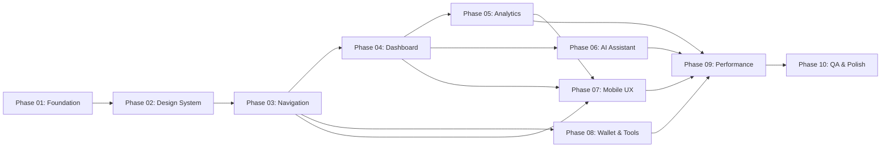

# PROJECT AETHER — MASTER DEVELOPMENT ROADMAP

**Version:** 1.0.0  
**Created:** May 21, 2026  
**Status:** ACTIVE — Single Source of Truth  
**Classification:** Implementation-Grade Blueprint  
**Codename:** AETHER (Architecture Evolution Toward Holistic Engineering Rebuilds)

---

> [!CAUTION]
> **THIS DOCUMENT IS THE SINGLE SOURCE OF TRUTH FOR ALL DEVELOPMENT ON GAJIAN AMAN.**
> Every Claude Code session, every developer, every PR MUST reference this document.
> Any contradiction between this document and other files — this document wins.
> Last updated: 2026-05-21. Update the version and date on every structural change.

---

## TABLE OF CONTENTS

| # | Section | Lines |
|---|---------|-------|
| 1 | [Project Vision & Identity](#1-project-vision--identity) | Strategic direction |
| 2 | [Architecture Principles](#2-architecture-principles) | 15 governing principles |
| 3 | [Implementation Philosophy](#3-implementation-philosophy) | Anti-bloat execution model |
| 4 | [Execution Governance](#4-execution-governance) | Session rules & workflow |
| 5 | [Folder Structure](#5-folder-structure) | New architecture layout |
| 6 | [Git Workflow & Branch Strategy](#6-git-workflow--branch-strategy) | Branching model |
| 7 | [Coding Standards](#7-coding-standards) | TypeScript/React conventions |
| 8 | [Design System Standards](#8-design-system-standards) | Tokens & component rules |
| 9 | [Figma Synchronization Rules](#9-figma-synchronization-rules) | Design-to-code pipeline |
| 10 | [Claude Code Session Rules](#10-claude-code-session-rules) | Context management |
| 11 | [Implementation Sequencing](#11-implementation-sequencing) | 10 phases detailed |
| 12 | [Dependency Mapping](#12-dependency-mapping) | Phase blockers |
| 13 | [Phase Map](#13-phase-map) | Overview table |
| 14 | [Risk Management](#14-risk-management) | Risk registry |
| 15 | [Rollback Strategy](#15-rollback-strategy) | Recovery procedures |
| 16 | [QA Strategy](#16-qa-strategy) | Testing framework |
| 17 | [Deployment Sequencing](#17-deployment-sequencing) | Release pipeline |
| 18 | [Completion Criteria](#18-completion-criteria) | Phase gates |
| 19 | [Context Preservation Rules](#19-context-preservation-rules) | Memory across sessions |
| 20 | [Mandatory Recap Structure](#20-mandatory-recap-structure) | Post-session template |
| 21 | [Anti-Context-Bloating Strategy](#21-anti-context-bloating-strategy) | Claude optimization |
| 22 | [Documentation Strategy](#22-documentation-strategy) | Living docs framework |
| 23 | [Technical Debt Prevention System](#23-technical-debt-prevention-system) | Guardrails |
| 24 | [Session Memory Persistence Format](#24-session-memory-persistence-format) | Recap schema |

---

## REFERENCE DOCUMENTS

This roadmap synthesizes and supersedes guidance from:

| Document | Path | Role |
|----------|------|------|
| Project Context | `/GAJIAN_AMAN_PROJECT_CONTEXT.md` | Current state reference |
| Revamp Audit | `/GAJIAN_AMAN_REVAMP_AUDIT_REPORT.md` | Problem identification |
| Redesign Strategy | `/GAJIAN_AMAN_REDESIGN_STRATEGY.md` | Future state blueprint |
| Figma System | `/GAJIAN_AMAN_FIGMA_PRODUCTION_SYSTEM.md` | Design system spec |
| Claude Instructions | `/CLAUDE.md` | Primary project instructions |

---

## 1. PROJECT VISION & IDENTITY

### 1.1 Product Identity

| Attribute | Value |
|-----------|-------|
| **Brand Name** | Gajian Aman ("Safe Until Payday") |
| **Internal Repo** | Fintrack |
| **Live Domain** | gajianaman.xyz |
| **Codename** | Project AETHER |
| **Target Users** | Indonesian salaried workers tracking monthly spending |
| **Mission** | Help users stay financially safe between paydays via AI-powered tracking and insights |
| **Brand Color** | `#4AE54A` (Gajian Green) |

### 1.2 The Transformation

**FROM (Current State):**
- 39 pages, 63 components, 35 hooks — feature-dense, overwhelming
- 21+ sidebar items causing cognitive overload
- Information density excessive on dashboard
- UI Quality: 7/10 | UX: 6.5/10 | Mobile: 6/10
- No ErrorBoundary, no unified loading/error states
- Component duplication (WalletFilterBar ×3, SkeletonCard duplicated)
- Context API fragmentation (4 nested providers)
- Basic AI assistant — no conversation history, no personality

**TO (Future State):**
- 15 essential screens, ~40 reusable components — focused, calm
- 5-tier bottom navigation — zero cognitive hunting
- Progressive disclosure — summary first, details on demand
- UI Quality: 9/10 | UX: 9/10 | Mobile: 9.5/10
- Unified ErrorBoundary, consistent loading/empty/error states
- Component consolidation — every component used ≥3 places
- Zustand for complex state, minimal Context for auth/theme
- Multi-turn AI chat with memory, personality, and actionable suggestions

### 1.3 Quality Target Matrix

| Dimension | Current | Target | Delta | Validation Method |
|-----------|---------|--------|-------|-------------------|
| UI Quality | 7/10 | 9/10 | +2.0 | Visual audit checklist per screen |
| UX Quality | 6.5/10 | 9/10 | +2.5 | Task completion time measurement |
| Mobile Experience | 6/10 | 9.5/10 | +3.5 | Thumb-zone heatmap, gesture audit |
| Design System | 8/10 | 9.5/10 | +1.5 | Token coverage check (100% required) |
| AI Integration | 5/10 | 9/10 | +4.0 | Multi-turn conversation test |
| Accessibility | 6/10 | 9/10 | +3.0 | WCAG AAA automated + manual audit |
| Performance | 7/10 | 9/10 | +2.0 | Lighthouse ≥90, LCP <2.5s, FID <100ms |

### 1.4 Design Philosophy

The redesigned Gajian Aman should feel like:

1. **Emotional Clarity** — Finances feel calm and understandable, never overwhelming
2. **Intelligent Proactivity** — AI anticipates needs before the user asks
3. **Progressive Transparency** — Complex data revealed on-demand; simple summaries by default
4. **Premium Modern** — Inspired by Linear, Notion, Revolut, and Copilot Money
5. **Indonesian Warmth** — Culturally resonant without condescension; built for salaried Indonesian workers
6. **Mobile-First Native** — Built for thumb interaction, not retrofitted from desktop

### 1.5 Tech Stack (Frozen)

| Layer | Technology | Version | Status |
|-------|-----------|---------|--------|
| Framework | React | 18.x | ✅ Frozen |
| Language | TypeScript | 5.8.x | ✅ Frozen |
| Build | Vite | 6.x | ✅ Frozen |
| Styling | Tailwind CSS | v4 | ✅ Frozen |
| Components | shadcn/ui + Radix | Latest | ✅ Frozen |
| Charts | Recharts | 2.x | ✅ Frozen |
| Animation | motion/react | 12.x | ✅ Frozen |
| Backend Client | Supabase JS | 2.x | ✅ Frozen |
| Router | react-router | 7.x | ✅ Frozen |
| Forms | react-hook-form | 7.x | ✅ Frozen |
| Toast | Sonner | 2.x | ✅ Frozen |
| State (new) | Zustand | Latest | 🔜 Phase 01 |
| AI Text | Claude Haiku | claude-haiku-4-5-20251001 | ✅ Frozen |
| AI Images (bot) | Gemini Flash | gemini-2.0-flash | ✅ Frozen |
| Database | Supabase PostgreSQL | v15+ | ✅ Frozen |
| Frontend Deploy | Vercel | — | ✅ Frozen |
| Bot Deploy | Railway | — | ✅ Frozen |

> [!WARNING]
> **NO new dependencies may be added without explicit justification in the session recap.**
> If a library is needed, it MUST be discussed before installation. Zero dependency creep tolerance.

---

## 2. ARCHITECTURE PRINCIPLES

These 15 principles govern ALL architectural decisions. Violations are grounds for PR rejection.

### Principle 01: Single Source of Truth (SSOT)
Every piece of data has exactly ONE canonical location. Types live in `types/`. Tokens live in `theme.css`. DB queries live in hooks. No duplication.

### Principle 02: Component Atomicity
Every component does ONE thing. If a component has more than 200 lines, it MUST be decomposed. If a component has more than 3 responsibilities, it MUST be split.

### Principle 03: Token-Driven Styling
ZERO hardcoded colors, spacing, or typography values. Every visual property references a design token via CSS variable. The only valid patterns are:
```typescript
// ✅ CORRECT
bgColorVar('sentiment-positive')
textColorVar('content-primary')
className="p-[var(--space-4)]"

// ❌ FORBIDDEN
className="bg-green-500"
className="bg-[#4AE54A]"
style={{ padding: '16px' }}
```

### Principle 04: Progressive Disclosure
Default to showing summaries. Details are revealed on user action (expand, click, drill-down). No screen should require scrolling past 3 viewport heights on mobile.

### Principle 05: Mobile-First, Desktop-Enhanced
Every component is designed for 375px first. Desktop layouts are additive enhancements. Breakpoints:
- Mobile: 375px (default)
- Tablet: 768px (`md:`)
- Desktop: 1024px (`lg:`)
- Wide: 1280px (`xl:`)

### Principle 06: Accessibility by Default (WCAG AAA)
- Minimum contrast: 7:1 for text, 3:1 for UI components
- Color NEVER the sole means of conveying information (icon + color + text)
- Keyboard navigation for ALL interactive elements
- Focus traps in ALL modals and drawers
- `aria-*` attributes on ALL non-semantic interactive elements
- `useReducedMotion()` check before ANY animation

### Principle 07: Hooks as Data Contract
Pages NEVER call `supabase.from()` directly. All data access is through hooks:
```typescript
// ✅ CORRECT
const { data, isLoading, error } = useTransactions(filters)

// ❌ FORBIDDEN
const { data } = await supabase.from('transactions').select('*')
```

### Principle 08: Error Resilience
- Every data-fetching component wraps in `<ErrorBoundary>`
- Every hook returns `{ data, isLoading, error, retry }` shape
- Every page has loading, error, and empty states — no exceptions

### Principle 09: Immutable Vendor Layer
shadcn/ui components in `components/ui/` are NEVER edited directly. Extend via wrapper components in `components/common/`.

### Principle 10: Consistent Animation System
All animations use presets from `lib/transitions.ts`. No inline animation values. All animated lists use `staggerChildren: 0.05`.
```typescript
// ✅ CORRECT
<motion.div {...fadeUp}>
// ❌ FORBIDDEN
<motion.div animate={{ opacity: 1, y: 0 }} transition={{ duration: 0.2 }}>
```

### Principle 11: Indonesian-First Localization
- All UI labels are in Bahasa Indonesia
- Currency: IDR via `formatRupiah()` — NEVER raw `Intl.NumberFormat` in components
- Timezone: `Asia/Jakarta` (WIB) — NEVER UTC display
- Categories: English in DB, Indonesian in UI (mapping in `categoryMetadata.ts`)

### Principle 12: Minimal Context Surface
Maximum 3 React Context providers. Complex state moves to Zustand stores. Context is reserved for:
1. Auth (authentication state)
2. Theme (light/dark mode, privacy mode)
3. Global filters (month, wallet — combined into one)

### Principle 13: Chunk Isolation
Every implementation session targets a maximum of 3-5 files. No session attempts to refactor more than one architectural layer simultaneously.

### Principle 14: Zero Dead Code Tolerance
If code is commented out, it must be deleted. If a component is unused, it must be removed. `// TODO` comments must reference a phase number: `// TODO(Phase-04): Add chart drill-down`.

### Principle 15: Predictable File Organization
File location is determinable from its name. `useTransactions.ts` is in `hooks/`. `TransactionRow.tsx` is in `components/`. `formatRupiah.ts` is in `lib/`. No ambiguity.

---

## 3. IMPLEMENTATION PHILOSOPHY

### 3.1 The Anti-Bloat Execution Model

The previous redesign attempt failed because:
1. **Context window bloating** — Claude received too much context, lost focus
2. **Implementation drift** — Changes snowballed beyond original scope
3. **No checkpoints** — No way to validate progress or roll back safely
4. **Monolithic sessions** — Trying to change too many files at once

Project AETHER solves this with **Modular Execution Governance**:

```
┌─────────────────────────────────────┐
│   MASTER ROADMAP (this document)    │  ← Strategic layer (never changes mid-session)
├─────────────────────────────────────┤
│   PHASE FILE (e.g., phase-03.md)   │  ← Tactical layer (scoped to current phase)
├─────────────────────────────────────┤
│   SESSION RECAP (timestamped)       │  ← Operational layer (memory between sessions)
├─────────────────────────────────────┤
│   CODE CHANGES (3-5 files max)      │  ← Execution layer (actual work product)
└─────────────────────────────────────┘
```

### 3.2 Core Execution Rules

| Rule | Description | Violation Consequence |
|------|-------------|----------------------|
| **Max 5 files per session** | No session touches more than 5 source files | Revert and re-scope |
| **Pre-flight mandatory** | Read master roadmap + phase file BEFORE coding | Session invalid |
| **Post-session mandatory** | Generate recap, update progress, record decisions | Session untracked |
| **No scope creep** | If you discover needed work outside current task, log it — don't do it | Revert extra work |
| **Validate before merge** | Every commit must pass: lint, build, responsive, a11y checks | Block merge |
| **Rollback-safe commits** | Every commit is a safe rollback point with descriptive message | Force amend |

### 3.3 Session Execution Flow

```
SESSION START
│
├── 1. READ master-development-roadmap.md (this file)
├── 2. READ current phase file (e.g., /phases/phase-03.md)
├── 3. READ last session recap (e.g., /session-recaps/2026-05-21-session.md)
├── 4. IDENTIFY specific task from phase file
├── 5. CONFIRM scope: "I will modify files X, Y, Z"
│
├── EXECUTE (3-5 files maximum)
│   ├── Code changes
│   ├── Test each change
│   └── Commit atomically
│
├── VALIDATE
│   ├── npm run lint (zero errors)
│   ├── npm run build (zero errors)
│   ├── Manual: responsive check (375px, 768px, 1280px)
│   ├── Manual: dark mode check
│   └── Manual: keyboard navigation check
│
├── POST-SESSION
│   ├── Generate session recap → /session-recaps/
│   ├── Update phase file progress
│   └── Record any deferred decisions
│
SESSION END
```

---

## 4. EXECUTION GOVERNANCE

### 4.1 Role Definitions

| Role | Responsibility |
|------|---------------|
| **Product Owner** | Gilang — final authority on priorities, features, design |
| **Architect** | Claude Code (guided by this roadmap) — technical decisions |
| **Implementer** | Claude Code — writes code within session scope |
| **Reviewer** | Gilang + automated checks — validates output |

### 4.2 Decision Authority Matrix

| Decision Type | Authority | Requires Approval? |
|---------------|-----------|-------------------|
| New dependency | Architect | ✅ Yes — must justify in recap |
| File restructure | Architect | ✅ Yes — must match Phase 01 plan |
| New component | Architect | ❌ No — if within phase scope |
| Design token change | Product Owner | ✅ Yes — Figma sync required |
| API endpoint change | Product Owner | ✅ Yes — bot impact assessment |
| Database schema change | Product Owner | ✅ Yes — migration plan required |
| Route change | Architect | ❌ No — if within Phase 03 plan |
| Bug fix | Implementer | ❌ No — but must document |

### 4.3 Communication Protocol

**Within sessions:**
- Claude states what it will do BEFORE doing it
- Claude confirms scope matches phase file
- Claude flags any scope concerns immediately

**Between sessions:**
- Session recaps are the ONLY communication channel
- No verbal agreements — everything in writing
- If context is unclear, the last recap is authoritative

### 4.4 Escalation Protocol

When Claude encounters a situation requiring decision:

```
1. STOP coding
2. Document the decision point in current recap
3. Provide 2-3 options with tradeoffs
4. Mark the decision as PENDING
5. Continue with OTHER tasks that don't depend on the decision
6. NEVER assume a default — always wait for explicit direction
```

---

## 5. FOLDER STRUCTURE

### 5.1 New Architecture (Target)

```
frontend/src/
├── app/
│   ├── App.tsx                          # Router + max 3 providers
│   ├── routes.tsx                       # Centralized route definitions
│   └── providers/
│       ├── AuthProvider.tsx             # Authentication context
│       ├── ThemeProvider.tsx            # Theme + privacy mode
│       └── FilterProvider.tsx           # Global month + wallet filter
│
├── components/
│   ├── ui/                              # shadcn/ui primitives (NEVER EDIT)
│   │   ├── button.tsx
│   │   ├── card.tsx
│   │   ├── dialog.tsx
│   │   └── ...
│   │
│   ├── common/                          # Shared reusable components
│   │   ├── ErrorBoundary.tsx            # Global error boundary
│   │   ├── ScreenStates.tsx             # LoadingState, ErrorState, EmptyState
│   │   ├── AmountDisplay.tsx            # Formatted IDR amount (mono font)
│   │   ├── CategoryIcon.tsx             # Category icon + color resolver
│   │   ├── StatusBadge.tsx              # Icon + color + text (triple-coded)
│   │   ├── FilterChips.tsx              # Wallet, date, category filter chips
│   │   ├── ChartContainer.tsx           # Recharts wrapper (legend, tooltip, responsive)
│   │   ├── PrivacyAmount.tsx            # Blur wrapper for amounts
│   │   ├── PageHeader.tsx               # Consistent page title + actions
│   │   └── ConfirmDialog.tsx            # Destructive action confirmation
│   │
│   ├── layout/                          # Layout components
│   │   ├── AppShell.tsx                 # Desktop sidebar + mobile bottom nav
│   │   ├── Sidebar.tsx                  # Desktop sidebar (200px, collapsible)
│   │   ├── BottomNav.tsx                # Mobile bottom navigation (5 icons)
│   │   ├── TopBar.tsx                   # Header: filters, privacy, notifications
│   │   └── MobileDrawer.tsx             # Settings drawer (mobile)
│   │
│   ├── features/                        # Feature-specific components
│   │   ├── transactions/
│   │   │   ├── TransactionRow.tsx
│   │   │   ├── TransactionList.tsx
│   │   │   ├── TransactionModal.tsx
│   │   │   ├── QuickAdd.tsx
│   │   │   └── TransactionFilters.tsx
│   │   ├── budgets/
│   │   │   ├── BudgetCard.tsx
│   │   │   ├── BudgetInlineEdit.tsx
│   │   │   └── BudgetProgress.tsx
│   │   ├── goals/
│   │   │   ├── GoalCard.tsx
│   │   │   ├── GoalContribute.tsx
│   │   │   └── MilestoneTracker.tsx
│   │   ├── analytics/
│   │   │   ├── HealthScore.tsx
│   │   │   ├── TrendChart.tsx
│   │   │   ├── CategoryBreakdown.tsx
│   │   │   └── ForecastCard.tsx
│   │   ├── ai/
│   │   │   ├── ChatBubble.tsx
│   │   │   ├── ChatInput.tsx
│   │   │   ├── SuggestedActions.tsx
│   │   │   └── InsightCard.tsx
│   │   └── wallets/
│   │       ├── WalletCard.tsx
│   │       ├── WalletTransfer.tsx
│   │       └── ReconcileDialog.tsx
│   │
│   └── charts/                          # Shared chart components
│       ├── AreaChartWidget.tsx
│       ├── BarChartWidget.tsx
│       ├── LineChartWidget.tsx
│       ├── PieChartWidget.tsx
│       └── ChartTooltip.tsx
│
├── pages/                               # 15 essential screens
│   ├── auth/
│   │   ├── Login.tsx
│   │   ├── AuthCallback.tsx
│   │   └── LinkTelegram.tsx
│   ├── onboarding/
│   │   └── Onboarding.tsx
│   ├── home/
│   │   └── Overview.tsx                 # Dashboard homepage
│   ├── spend/
│   │   ├── Spending.tsx                 # Category breakdown
│   │   ├── Budget.tsx                   # Budget management
│   │   └── Goals.tsx                    # Savings goals
│   ├── analytics/
│   │   ├── Reports.tsx                  # Monthly report (Laporan)
│   │   ├── Trends.tsx                   # Trend analysis (Tren)
│   │   └── Forecasting.tsx             # Expense forecasting
│   ├── tools/
│   │   ├── Wallets.tsx                  # Multi-wallet management
│   │   ├── Recurring.tsx                # Recurring bills
│   │   ├── Categories.tsx               # Category management
│   │   └── History.tsx                  # Transaction history (Riwayat)
│   ├── ai/
│   │   └── Assistant.tsx                # AI chat assistant
│   └── public/
│       ├── Landing.tsx
│       ├── Privacy.tsx
│       └── FAQ.tsx
│
├── hooks/                               # Custom React hooks
│   ├── data/                            # Data-fetching hooks
│   │   ├── useTransactions.ts
│   │   ├── useBudgets.ts
│   │   ├── useGoals.ts
│   │   ├── useWallets.ts
│   │   ├── useCategories.ts
│   │   ├── useRecurringBills.ts
│   │   ├── useInsights.ts
│   │   ├── useFinancialHealth.ts
│   │   ├── useTrends.ts
│   │   └── useForecasting.ts
│   ├── ui/                              # UI behavior hooks
│   │   ├── useMediaQuery.ts
│   │   ├── useReducedMotion.ts
│   │   ├── useScrollPosition.ts
│   │   └── useKeyboardShortcuts.ts
│   └── auth/
│       └── useAuth.ts
│
├── stores/                              # Zustand stores
│   ├── filterStore.ts                   # Month + wallet + category filters
│   ├── privacyStore.ts                  # Amount blur state
│   └── navigationStore.ts              # Active tab persistence
│
├── lib/                                 # Utilities (pure functions)
│   ├── supabase.ts                      # Client + ALL TypeScript types
│   ├── utils.ts                         # cn(), formatRupiah(), color helpers
│   ├── transitions.ts                   # Animation presets
│   ├── categoryMetadata.ts              # Category → icon/color/label mapping
│   ├── chartFormatters.ts               # Recharts axis/tooltip utilities
│   ├── validators.ts                    # Form validation schemas
│   └── constants.ts                     # App-wide constants
│
├── types/                               # TypeScript type definitions
│   ├── database.ts                      # Supabase table types
│   ├── api.ts                           # API response types
│   ├── ui.ts                            # Component prop types
│   └── index.ts                         # Re-exports
│
└── styles/
    ├── theme.css                        # ALL design tokens (@theme inline)
    ├── fonts.css                        # Font imports
    └── index.css                        # Base styles, accessibility, scrollbars
```

### 5.2 Migration Strategy

The folder restructure happens in Phase 01. Key migrations:

| Old Location | New Location | Phase |
|-------------|-------------|-------|
| `app/components/Layout.tsx` | `components/layout/AppShell.tsx` | Phase 03 |
| `app/components/TransactionModal.tsx` | `components/features/transactions/TransactionModal.tsx` | Phase 04 |
| `app/pages/*.tsx` | `pages/{section}/*.tsx` | Phase 01 scaffold |
| `hooks/useAuth.tsx` | `hooks/auth/useAuth.ts` | Phase 01 |
| `hooks/useMonthFilter.tsx` | `stores/filterStore.ts` | Phase 01 |
| `hooks/usePrivacy.tsx` | `stores/privacyStore.ts` | Phase 01 |

> [!IMPORTANT]
> **Phase 01 creates the folder structure with placeholder files.** Actual component migration happens in subsequent phases. This prevents breaking the live app during restructure.

---

## 6. GIT WORKFLOW & BRANCH STRATEGY

### 6.1 Branch Architecture

```
main                          ← Production (gajianaman.xyz)
├── develop                   ← Integration branch (staging)
│   ├── phase/01-foundation   ← Phase branch
│   ├── phase/02-design       ← Phase branch
│   ├── phase/03-navigation   ← Phase branch
│   └── ...                   ← One branch per phase
│
└── hotfix/*                  ← Emergency production fixes
```

### 6.2 Branch Lifecycle

```
1. CREATE phase branch from develop
   git checkout develop
   git checkout -b phase/01-foundation

2. WORK in phase branch (multiple sessions)
   git add . && git commit -m "feat(phase-01): scaffold folder structure"

3. VALIDATE before merge
   npm run lint && npm run build && npm run test

4. MERGE to develop (squash merge)
   git checkout develop
   git merge --squash phase/01-foundation
   git commit -m "feat: complete Phase 01 — Foundation & Governance Setup"

5. DELETE phase branch
   git branch -d phase/01-foundation

6. DEPLOY to staging (automatic via develop → Vercel preview)

7. MERGE develop to main (only after phase validation)
   git checkout main
   git merge develop
```

### 6.3 Commit Convention

```
<type>(<scope>): <description>

Types:
  feat     — New feature or component
  fix      — Bug fix
  refactor — Code restructure (no behavior change)
  style    — Formatting, token updates (no logic change)
  docs     — Documentation only
  chore    — Build, config, dependencies
  test     — Adding or fixing tests
  perf     — Performance improvement

Scopes:
  phase-XX — Phase number (01-10)
  layout   — Layout components
  nav      — Navigation
  design   — Design system
  ai       — AI assistant
  charts   — Chart components
  a11y     — Accessibility
  perf     — Performance

Examples:
  feat(phase-03): implement BottomNav with 5-icon system
  fix(phase-04): resolve chart tooltip overlap on mobile
  refactor(phase-01): migrate useMonthFilter to Zustand store
  docs(phase-01): add session recap for 2026-05-21
```

### 6.4 Commit Atomicity Rules

| Rule | Description |
|------|-------------|
| **One concern per commit** | Each commit addresses exactly one logical change |
| **Buildable state** | Every commit must result in a buildable, runnable app |
| **Descriptive message** | Message explains WHY, not just WHAT |
| **File count limit** | No commit touches more than 8 files |
| **No WIP commits** | Never commit work-in-progress to a phase branch |

---

## 7. CODING STANDARDS

### 7.1 TypeScript Rules

```typescript
// ✅ REQUIRED: Explicit return types on exported functions
export function formatRupiah(amount: number): string { ... }

// ✅ REQUIRED: Interface for component props (not type alias)
interface TransactionRowProps {
  transaction: Transaction
  onEdit: (id: string) => void
  isCompact?: boolean
}

// ✅ REQUIRED: Const assertion for constants
const CATEGORY_COLORS = {
  food: '#F59E0B',
  transport: '#3B82F6',
} as const

// ❌ FORBIDDEN: any type
function processData(data: any) { ... } // NEVER

// ❌ FORBIDDEN: Non-null assertion outside of tests
const user = data!.user // NEVER in production code

// ✅ REQUIRED: Discriminated unions for state
type DataState<T> =
  | { status: 'loading' }
  | { status: 'error'; error: Error; retry: () => void }
  | { status: 'empty' }
  | { status: 'success'; data: T }
```

### 7.2 React Component Rules

```typescript
// ✅ REQUIRED: Function component with explicit FC type omission
export function TransactionRow({ transaction, onEdit }: TransactionRowProps) {
  // ✅ REQUIRED: Hooks at top, then derived state, then handlers, then render
  const { data } = useTransactions()
  const formattedAmount = formatRupiah(transaction.amount)

  const handleEdit = useCallback(() => {
    onEdit(transaction.id)
  }, [onEdit, transaction.id])

  return (...)
}

// ❌ FORBIDDEN: React.FC (adds implicit children prop)
const TransactionRow: React.FC<Props> = () => { ... }

// ✅ REQUIRED: Named exports only (no default exports)
export function TransactionRow() { ... }

// ❌ FORBIDDEN: Default exports
export default function TransactionRow() { ... }
```

### 7.3 File Naming Convention

| Type | Convention | Example |
|------|-----------|---------|
| Components | PascalCase.tsx | `TransactionRow.tsx` |
| Hooks | camelCase.ts | `useTransactions.ts` |
| Utilities | camelCase.ts | `formatRupiah.ts` |
| Types | camelCase.ts | `database.ts` |
| Stores | camelCase.ts | `filterStore.ts` |
| Constants | camelCase.ts | `constants.ts` |
| Tests | `*.test.ts(x)` | `TransactionRow.test.tsx` |

### 7.4 Import Order

```typescript
// 1. React & framework
import { useState, useCallback } from 'react'
import { useNavigate } from 'react-router'

// 2. Third-party libraries
import { motion } from 'motion/react'
import { toast } from 'sonner'

// 3. Internal: components
import { Button } from '@/components/ui/button'
import { AmountDisplay } from '@/components/common/AmountDisplay'

// 4. Internal: hooks & stores
import { useTransactions } from '@/hooks/data/useTransactions'
import { useFilterStore } from '@/stores/filterStore'

// 5. Internal: lib & utils
import { cn, formatRupiah } from '@/lib/utils'
import { fadeUp } from '@/lib/transitions'

// 6. Internal: types
import type { Transaction } from '@/types/database'

// 7. Styles (last, rare — prefer Tailwind)
import './custom-styles.css'
```

### 7.5 Hook Composition Pattern

Every data hook MUST return this shape:

```typescript
interface UseDataResult<T> {
  data: T | null
  isLoading: boolean
  error: Error | null
  retry: () => void
  // Optional mutations:
  create?: (input: CreateInput) => Promise<void>
  update?: (id: string, input: UpdateInput) => Promise<void>
  remove?: (id: string) => Promise<void>
}
```

### 7.6 Color Application (CRITICAL)

```typescript
// ✅ ALWAYS use helper functions from @/lib/utils:
import { bgColorVar, textColorVar, borderColorVar, colorVar } from '@/lib/utils'

bgColorVar('sentiment-positive')    // → "bg-[var(--color-sentiment-positive)]"
textColorVar('content-primary')     // → "text-[var(--color-content-primary)]"
borderColorVar('brand-primary')     // → "border-[var(--color-brand-primary)]"
colorVar('sidebar-bg')              // → "var(--color-sidebar-bg)"

// ❌ NEVER:
className="bg-green-500"            // Raw Tailwind
className="bg-[#4AE54A]"           // Hardcoded hex
style={{ color: '#4AE54A' }}        // Inline hex
```

---

## 8. DESIGN SYSTEM STANDARDS

### 8.1 Token Architecture

All design tokens live in `frontend/src/styles/theme.css` using Tailwind CSS v4's `@theme inline` directive.

**Token Categories:**

| Category | Prefix | Example |
|----------|--------|---------|
| Brand Colors | `--color-brand-*` | `--color-brand-primary: #4AE54A` |
| Content Colors | `--color-content-*` | `--color-content-primary: #1A2B1A` |
| Background Colors | `--color-bg-*` | `--color-bg-screen: #F4F6F4` |
| Sentiment Colors | `--color-sentiment-*` | `--color-sentiment-positive: #2F5711` |
| Category Colors | `--color-cat-*` | `--color-cat-food: #F59E0B` |
| Typography | `--text-*` | `--text-h1: 1.75rem` |
| Spacing | `--space-*` | `--space-4: 16px` |
| Radius | `--radius-*` | `--radius-md: 12px` |
| Shadow | `--shadow-*` | `--shadow-card: 0 1px 2px ...` |
| Motion | `--duration-*`, `--ease-*` | `--duration-fast: 150ms` |

### 8.2 Typography System

| Token | Desktop | Mobile | Font | Weight | Use |
|-------|---------|--------|------|--------|-----|
| `--text-display` | 32px | 28px | Manrope | 700 | Hero metrics |
| `--text-h1` | 28px | 24px | Manrope | 700 | Page titles |
| `--text-h2` | 22px | 20px | Manrope | 600 | Section headers |
| `--text-h3` | 18px | 16px | Manrope | 600 | Card headers |
| `--text-body-lg` | 16px | 16px | Plus Jakarta Sans | 400 | Primary body |
| `--text-body` | 14px | 14px | Plus Jakarta Sans | 400 | Secondary body |
| `--text-caption` | 12px | 12px | Plus Jakarta Sans | 400 | Labels, hints |
| `--text-mono-lg` | 20px | 18px | DM Mono | 600 | Large amounts |
| `--text-mono` | 16px | 16px | DM Mono | 500 | Standard amounts |
| `--text-mono-sm` | 14px | 14px | DM Mono | 400 | Small amounts |

**Font Family Rules:**
- **Manrope** → headings, buttons, nav labels
- **Plus Jakarta Sans** → body text, descriptions, form labels
- **DM Mono** → ALL financial amounts, percentages, dates in data contexts

### 8.3 Color System (Frozen)

**Brand:**
```css
--color-brand-primary:       #4AE54A;   /* Gajian Green — primary accent */
--color-brand-primary-dark:  #38C428;   /* Hover/active states */
--color-brand-primary-light: #DCFCE7;   /* Light backgrounds */
--color-brand-primary-fg:    #0D2818;   /* Text on brand color */
```

**Sentiment (ALWAYS dual-coded: icon + color):**
```css
--color-sentiment-positive:    #2F5711;   /* Income, safe, on-track */
--color-sentiment-positive-bg: #F0FDF4;
--color-sentiment-negative:    #A8200D;   /* Expense, over-budget */
--color-sentiment-negative-bg: #FEF2F2;
--color-sentiment-warning:     #EDC843;   /* Near limit, caution */
--color-sentiment-warning-bg:  #FFFBEB;
```

**Categories (10 distinct, WCAG AA minimum):**
```css
--color-cat-food:          #F59E0B;   /* Amber */
--color-cat-transport:     #3B82F6;   /* Blue */
--color-cat-groceries:     #10B981;   /* Emerald (changed from brand green) */
--color-cat-shopping:      #EC4899;   /* Pink */
--color-cat-bills:         #8B5CF6;   /* Purple */
--color-cat-health:        #EF4444;   /* Red */
--color-cat-entertainment: #F97316;   /* Orange */
--color-cat-education:     #06B6D4;   /* Cyan */
--color-cat-income:        #059669;   /* Green-600 */
--color-cat-savings:       #0891B2;   /* Teal */
```

### 8.4 Spacing Rules (8px Baseline)

| Token | Value | Use Case |
|-------|-------|----------|
| `--space-1` | 4px | Icon-text gap, micro adjustment |
| `--space-2` | 8px | Small gaps, input internal padding |
| `--space-3` | 12px | Form field gaps, list item spacing |
| `--space-4` | 16px | Card internal padding (mobile), section gaps |
| `--space-5` | 20px | Card gaps |
| `--space-6` | 24px | Card internal padding (desktop), section spacing |
| `--space-8` | 32px | Major section spacing |
| `--space-10` | 40px | Page section breathing room |
| `--space-12` | 48px | Hero section padding |

**Responsive Spacing Rules:**
```
Desktop (lg:):  Full spacing scale
Tablet (md:):   Section margins × 0.8
Mobile:         Section margins × 0.6, card padding = 16px
```

### 8.5 Elevation System (6 Levels)

| Level | Token | Shadow Value | Use Case |
|-------|-------|-------------|----------|
| 0 | `--shadow-none` | `none` | Flat surfaces |
| 1 | `--shadow-card` | `0 1px 3px rgba(13,40,24,0.06)` | Cards, inputs |
| 2 | `--shadow-card-hover` | `0 4px 12px rgba(13,40,24,0.10)` | Card hover |
| 3 | `--shadow-float` | `0 12px 24px rgba(13,40,24,0.15)` | FAB, tooltips |
| 4 | `--shadow-dropdown` | `0 20px 40px rgba(13,40,24,0.20)` | Popover, dropdown |
| 5 | `--shadow-modal` | `0 25px 50px rgba(13,40,24,0.25)` | Modal, sidebar |

### 8.6 Component Hierarchy

```
Layer 1: Primitives (Design tokens → CSS variables)
Layer 2: Atoms (Icon, Badge, Divider, Text, Input, StatusIndicator)
Layer 3: Molecules (Button, Chip, Tab, AmountInput, CategoryPill, MiniChart)
Layer 4: Organisms (Card, ListItem, TransactionRow, BottomSheet, Modal, NavBar, ChartContainer, ChatBubble)
Layer 5: Templates (ListTemplate, GridTemplate, FormTemplate, AnalyticsTemplate, EmptyState, LoadingState)
Layer 6: Screens (15 pages — full compositions)
```

---

## 9. FIGMA SYNCHRONIZATION RULES

### 9.1 Design-to-Code Pipeline

```
Figma Design System v2.0 (Master)
        ↓
  Token Export (manual JSON → theme.css)
        ↓
  Component Spec (Figma component → React component)
        ↓
  Screen Comp (Figma screen → React page)
        ↓
  Code Implementation (matches Figma 1:1)
        ↓
  Visual QA (screenshot comparison)
```

### 9.2 Figma Reference Sources

| Reference | Purpose | Authority Level |
|-----------|---------|----------------|
| QPay Digital Wallet UI Kit | Premium fintech aesthetics, wallet-first interface, bottom nav | DNA Source |
| Wise Design System | Accessibility benchmark, interaction quality, status patterns | DNA Source |
| Data Visualization UI Kit | Dashboard storytelling, chart architecture, hero metrics | DNA Source |
| Responsive Dynamic Table | Transaction table redesign, expandable rows, mobile card fallback | DNA Source |
| Awwwards Bottom Navigation | Modern animated mobile nav, icon + label patterns | DNA Source |
| GA Design System v2.0 | Current token values, existing components (migration source) | Legacy (NOT authoritative) |

### 9.3 Sync Rules

| Rule | Description |
|------|-------------|
| **Figma leads tokens** | Token values originate in Figma. Code follows. |
| **Code leads interaction** | Interaction patterns (hover, focus, animation) are defined in code. |
| **No undesigned screens** | Every screen MUST have a Figma comp before implementation. |
| **Tolerance: ±2px** | Visual output must match Figma within 2px. |
| **Component parity** | Every Figma component has exactly one React counterpart. |
| **Token naming match** | Figma token names MUST match CSS variable names. |

### 9.4 Token Sync Procedure

```
1. Designer updates token in Figma
2. Export tokens.json from Figma
3. Run sync script: transforms tokens.json → theme.css variables
4. Commit: "style(design): sync tokens from Figma export [date]"
5. Visual regression check on affected components
```

---

## 10. CLAUDE CODE SESSION RULES

### 10.1 Context Budget

| Metric | Limit | Rationale |
|--------|-------|-----------|
| **Max files read per session** | 8 files | Prevent context bloat |
| **Max files modified per session** | 5 files | Prevent scope creep |
| **Max lines written per session** | 500 lines | Maintain quality focus |
| **Pre-flight reads** | 2-3 files max | Master roadmap + phase file + last recap |
| **Session duration target** | 30-60 minutes | Prevent fatigue-driven errors |

### 10.2 Pre-Flight Checklist

Before ANY code is written, Claude MUST:

- [ ] Read `master-development-roadmap.md` (Sections 2, 3, 7 minimum)
- [ ] Read current phase file (`/phases/phase-XX.md`)
- [ ] Read last session recap (`/session-recaps/YYYY-MM-DD-session.md`)
- [ ] Confirm target files (list exactly which files will be created/modified)
- [ ] Confirm scope boundary (state what is OUT of scope)

### 10.3 Mid-Session Guardrails

During coding, Claude MUST:

- **CHECK** file count after every commit — abort if >5 files modified
- **CHECK** for scope creep — if encountering work outside current task, log it in recap and STOP
- **CHECK** for dependency introduction — any new `npm install` requires justification
- **NEVER** refactor code that isn't in the current task scope
- **NEVER** "fix" things discovered during implementation unless they're blocking

### 10.4 Post-Session Mandatory Actions

After every session, Claude MUST:

1. Generate session recap → `/session-recaps/YYYY-MM-DD-session-N.md`
2. Update phase file progress checkboxes
3. Log any deferred decisions with context
4. Log any discovered issues for future phases
5. Confirm: "All changes build without errors"

### 10.5 Context Recovery Protocol

When starting a NEW session with no prior context:

```
1. Read master-development-roadmap.md (this file) — Sections 1-3
2. Scan /session-recaps/ for latest recap file
3. Read latest recap to understand:
   - Last completed task
   - Current phase and sub-task
   - Pending decisions
   - Known issues
4. Read current phase file for task list
5. Confirm understanding: "I am resuming Phase X, Task Y"
6. Begin work
```

---

## 11. IMPLEMENTATION SEQUENCING

### PHASE 01: Foundation & Governance Setup

**Duration:** 1-2 sessions  
**Branch:** `phase/01-foundation`  
**Dependencies:** None (starting point)

**Objectives:**
1. Create folder structure (scaffolding only, no component migration)
2. Set up governance files
3. Install and configure Zustand
4. Create phase files for all 10 phases
5. Create session-recaps directory with template
6. Set up ErrorBoundary component

**Tasks:**

| # | Task | Files | Status |
|---|------|-------|--------|
| 1.1 | Create `/phases/` directory with phase-01 through phase-10 stubs | 10 files | ⬜ |
| 1.2 | Create `/session-recaps/` directory with template | 2 files | ⬜ |
| 1.3 | Scaffold new folder structure (`components/`, `pages/`, `stores/`, `types/`) | Directories only | ⬜ |
| 1.4 | Install Zustand; create `filterStore.ts`, `privacyStore.ts`, `navigationStore.ts` | 4 files | ⬜ |
| 1.5 | Create `ErrorBoundary.tsx` component | 1 file | ⬜ |
| 1.6 | Create `types/database.ts` — extract types from `supabase.ts` | 2 files | ⬜ |
| 1.7 | Create `constants.ts` — extract magic values | 1 file | ⬜ |

**Validation:**
- [ ] All new directories exist with correct structure
- [ ] Zustand stores compile and export correctly
- [ ] `npm run build` passes without errors
- [ ] ErrorBoundary renders fallback on throw

---

### PHASE 02: Design System & Token Architecture

**Duration:** 2-3 sessions  
**Branch:** `phase/02-design`  
**Dependencies:** Phase 01 complete

**Objectives:**
1. Refine and document all design tokens in `theme.css`
2. Create shared common components (StatusBadge, AmountDisplay, CategoryIcon)
3. Create ChartContainer wrapper
4. Ensure WCAG AAA compliance on all token values
5. Consolidate duplicate components (WalletFilterBar → FilterChips)

**Tasks:**

| # | Task | Files | Status |
|---|------|-------|--------|
| 2.1 | Audit and update `theme.css` — fix color conflicts, add missing tokens | 1 file | ⬜ |
| 2.2 | Create `AmountDisplay.tsx` — formatted IDR with mono font | 1 file | ⬜ |
| 2.3 | Create `StatusBadge.tsx` — triple-coded (icon + color + text) | 1 file | ⬜ |
| 2.4 | Create `CategoryIcon.tsx` — resolves category to icon/color | 1 file | ⬜ |
| 2.5 | Create `ChartContainer.tsx` — wrapper with legend, tooltip, responsive | 1 file | ⬜ |
| 2.6 | Create `FilterChips.tsx` — replaces 3× WalletFilterBar | 1 file | ⬜ |
| 2.7 | Create `PageHeader.tsx` — consistent page title + actions | 1 file | ⬜ |
| 2.8 | Update `ScreenStates.tsx` — unified Loading, Error, Empty | 1 file | ⬜ |
| 2.9 | WCAG AAA contrast audit on all color tokens | Audit doc | ⬜ |
| 2.10 | Create `ConfirmDialog.tsx` — destructive action confirmation | 1 file | ⬜ |

**Validation:**
- [ ] All common components render correctly in isolation
- [ ] No hardcoded colors remain in new components
- [ ] All text meets 7:1 contrast ratio
- [ ] `npm run build` passes without errors

---

### PHASE 03: Navigation & Layout Restructuring

**Duration:** 3-4 sessions  
**Branch:** `phase/03-navigation`  
**Dependencies:** Phase 02 complete

**Objectives:**
1. Replace sidebar-based navigation with 5-tier system
2. Build BottomNav component for mobile
3. Build Sidebar component for desktop (collapsible)
4. Build AppShell that switches between layouts
5. Build TopBar with unified filter controls
6. Implement route restructure to 15 screens

**Tasks:**

| # | Task | Files | Status |
|---|------|-------|--------|
| 3.1 | Create `BottomNav.tsx` — 5 icons (Home, Spend, Analytics, Tools, AI) | 1 file | ⬜ |
| 3.2 | Create `Sidebar.tsx` — desktop sidebar with collapse mode | 1 file | ⬜ |
| 3.3 | Create `TopBar.tsx` — header with filters, privacy toggle, notifications | 1 file | ⬜ |
| 3.4 | Create `AppShell.tsx` — responsive layout switcher | 1 file | ⬜ |
| 3.5 | Create `routes.tsx` — centralized route definitions (15 screens) | 1 file | ⬜ |
| 3.6 | Update `App.tsx` — new provider chain (max 3), new router | 1 file | ⬜ |
| 3.7 | Create `MobileDrawer.tsx` — settings/profile access on mobile | 1 file | ⬜ |
| 3.8 | Implement navigation state persistence via `navigationStore.ts` | 1 file | ⬜ |
| 3.9 | Add keyboard navigation for desktop nav items | Update files | ⬜ |
| 3.10 | Remove old Layout.tsx and MobileNav.tsx (deprecate) | 2 files | ⬜ |

**Validation:**
- [ ] Bottom nav shows on mobile, sidebar shows on desktop
- [ ] All 15 routes resolve correctly
- [ ] Active nav item highlighted on both mobile and desktop
- [ ] Keyboard navigation works (Tab, Enter, Arrow keys)
- [ ] Navigation state persists across page changes
- [ ] `npm run build` passes without errors

---

### PHASE 04: Dashboard & Overview Modernization

**Duration:** 3-4 sessions  
**Branch:** `phase/04-dashboard`  
**Dependencies:** Phase 03 complete

**Objectives:**
1. Redesign Overview page with hero metric + progressive disclosure
2. Implement "Available to Spend" calculation
3. Create AI insight card component
4. Build collapsible sections
5. Implement dashboard storytelling hierarchy

**Tasks:**

| # | Task | Files | Status |
|---|------|-------|--------|
| 4.1 | Create hero metric card (balance, YTD savings) | 1 file | ⬜ |
| 4.2 | Create status row (Income, Spent, Available) | 1 file | ⬜ |
| 4.3 | Create AI quick insight widget | 1 file | ⬜ |
| 4.4 | Implement spending breakdown chart (using ChartContainer) | 1 file | ⬜ |
| 4.5 | Create top spending categories component | 1 file | ⬜ |
| 4.6 | Create goal progress mini-cards | 1 file | ⬜ |
| 4.7 | Create upcoming bills widget | 1 file | ⬜ |
| 4.8 | Implement collapsible section component | 1 file | ⬜ |
| 4.9 | Compose Overview.tsx from above components | 1 file | ⬜ |
| 4.10 | Loading/empty/error states for all dashboard widgets | Updates | ⬜ |

**Validation:**
- [ ] Dashboard loads in <2 seconds
- [ ] Hero metric shows correct balance calculation
- [ ] AI insight renders without API error
- [ ] Collapsible sections animate correctly (respects reduced motion)
- [ ] Mobile view fits within 3 viewport heights
- [ ] All amounts use `AmountDisplay` component

---

### PHASE 05: Analytics & Visualization System

**Duration:** 3-4 sessions  
**Branch:** `phase/05-analytics`  
**Dependencies:** Phase 04 complete

**Objectives:**
1. Rebuild Laporan (Reports) with insights-first layout
2. Rebuild Tren (Trends) with 3/6/12 month toggle
3. Rebuild Forecasting with methodology transparency
4. Create shared chart widget components
5. Implement health score with inline explanation

**Tasks:**

| # | Task | Files | Status |
|---|------|-------|--------|
| 5.1 | Create `AreaChartWidget.tsx` | 1 file | ⬜ |
| 5.2 | Create `BarChartWidget.tsx` | 1 file | ⬜ |
| 5.3 | Create `LineChartWidget.tsx` | 1 file | ⬜ |
| 5.4 | Create `HealthScore.tsx` — linear bar with explanation | 1 file | ⬜ |
| 5.5 | Rebuild `Reports.tsx` — insights above charts | 1 file | ⬜ |
| 5.6 | Rebuild `Trends.tsx` — stacked area with time toggle | 1 file | ⬜ |
| 5.7 | Rebuild `Forecasting.tsx` — methodology card, inline adjust | 1 file | ⬜ |
| 5.8 | Create `CategoryBreakdown.tsx` — reusable pie/bar | 1 file | ⬜ |
| 5.9 | Create `ForecastCard.tsx` — per-category forecast | 1 file | ⬜ |
| 5.10 | Implement comparison mode for reports (month-over-month) | 1 file | ⬜ |

**Validation:**
- [ ] All charts render correctly at 375px, 768px, 1280px
- [ ] Chart tooltips are tap-accessible on mobile
- [ ] Legends present on ALL charts
- [ ] Health score explanation is visible (not hidden behind tooltip)
- [ ] Time toggle (3m/6m/12m) works on Trends
- [ ] `useReducedMotion` disables chart animations when active

---

### PHASE 06: AI Assistant & Intelligence Layer

**Duration:** 3-4 sessions  
**Branch:** `phase/06-ai`  
**Dependencies:** Phase 04 complete (insights widget)

**Objectives:**
1. Build multi-turn chat interface
2. Implement conversation history (session storage → Supabase later)
3. Build typing indicator
4. Implement suggested follow-ups
5. Build contextual action buttons
6. Create AI personality system prompt

**Tasks:**

| # | Task | Files | Status |
|---|------|-------|--------|
| 6.1 | Create `ChatBubble.tsx` — user/assistant variants | 1 file | ⬜ |
| 6.2 | Create `ChatInput.tsx` — input with send, clear, attach | 1 file | ⬜ |
| 6.3 | Create `SuggestedActions.tsx` — AI-generated follow-up chips | 1 file | ⬜ |
| 6.4 | Create `InsightCard.tsx` — proactive insight with action button | 1 file | ⬜ |
| 6.5 | Build `Assistant.tsx` — full chat page composition | 1 file | ⬜ |
| 6.6 | Create `useChat.ts` hook — multi-turn state, history, API call | 1 file | ⬜ |
| 6.7 | Create AI system prompt template (Indonesian personality) | 1 file | ⬜ |
| 6.8 | Implement typing indicator animation | 1 file | ⬜ |
| 6.9 | Implement conversation history (sessionStorage first) | Update | ⬜ |
| 6.10 | Implement contextual actions ("Set Budget", "Create Goal") | Update | ⬜ |

**Validation:**
- [ ] Multi-turn conversation works (5+ messages context)
- [ ] Typing indicator shows during API call
- [ ] Suggested follow-ups appear after each response
- [ ] Action buttons trigger correct mutations
- [ ] Conversation persists within browser session
- [ ] AI responses use Indonesian language and second-person ("Anda/kamu")

---

### PHASE 07: Mobile-First UX Optimization

**Duration:** 2-3 sessions  
**Branch:** `phase/07-mobile`  
**Dependencies:** Phase 03, 04, 05 complete

**Objectives:**
1. Thumb-zone optimization for all interactive elements
2. Swipe gestures on transaction list
3. Bottom sheet for filters and secondary actions
4. Touch target audit (≥44px minimum)
5. Responsive spacing adjustment

**Tasks:**

| # | Task | Files | Status |
|---|------|-------|--------|
| 7.1 | Audit and fix all touch targets (44px minimum) | Multiple | ⬜ |
| 7.2 | Implement swipe actions on transaction rows (archive, delete) | 2 files | ⬜ |
| 7.3 | Create bottom sheet for filter controls | 1 file | ⬜ |
| 7.4 | Implement long-press context menu | 1 file | ⬜ |
| 7.5 | Responsive spacing pass on all 15 pages | Multiple | ⬜ |
| 7.6 | Implement mobile card-list fallback for tables | 1 file | ⬜ |
| 7.7 | FAB positioning audit (no collision with bottom nav) | 1 file | ⬜ |
| 7.8 | Implement pull-to-refresh on list pages | 1 file | ⬜ |

**Validation:**
- [ ] All interactive elements ≥44px touch target
- [ ] Swipe gestures work on iOS Safari and Chrome Android
- [ ] Bottom sheet opens/closes with spring animation
- [ ] No FAB collision with bottom nav
- [ ] All pages usable with one thumb (bottom 40% of screen)

---

### PHASE 08: Wallet & Financial Tools System

**Duration:** 2-3 sessions  
**Branch:** `phase/08-tools`  
**Dependencies:** Phase 03 complete

**Objectives:**
1. Rebuild Wallet management page
2. Rebuild Recurring bills page
3. Rebuild Transaction History (Riwayat) with expandable rows
4. Implement category management
5. Add inline budget editing

**Tasks:**

| # | Task | Files | Status |
|---|------|-------|--------|
| 8.1 | Rebuild `Wallets.tsx` — hero balance, wallet cards, reconciliation | 2 files | ⬜ |
| 8.2 | Rebuild `Recurring.tsx` — due dates, pay/snooze actions | 2 files | ⬜ |
| 8.3 | Rebuild `History.tsx` — chip filters, sort, expandable rows | 2 files | ⬜ |
| 8.4 | Rebuild `Categories.tsx` — visual color picker, merge workflow | 2 files | ⬜ |
| 8.5 | Rebuild `Spending.tsx` — tab view (Chart/List/Budget), drill-down | 2 files | ⬜ |
| 8.6 | Rebuild `Budget.tsx` — inline edit, AI recommendations | 2 files | ⬜ |
| 8.7 | Rebuild `Goals.tsx` — milestone tracker, contribution, countdown | 2 files | ⬜ |

**Validation:**
- [ ] Wallet reconciliation flow works end-to-end
- [ ] Recurring bills show correct due dates and statuses
- [ ] Transaction history expandable rows show details inline
- [ ] Category color picker saves and displays correctly
- [ ] Budget inline edit saves on blur/Enter
- [ ] Goal contribution updates saved_amount correctly

---

### PHASE 09: Performance & Optimization

**Duration:** 2-3 sessions  
**Branch:** `phase/09-performance`  
**Dependencies:** Phase 04-08 complete

**Objectives:**
1. Route-based code splitting
2. Bundle size optimization
3. Image/asset optimization
4. Memoization pass on expensive renders
5. Lighthouse audit and fixes

**Tasks:**

| # | Task | Files | Status |
|---|------|-------|--------|
| 9.1 | Implement `React.lazy()` for all page routes | 1 file | ⬜ |
| 9.2 | Optimize Recharts imports (tree-shake unused chart types) | Multiple | ⬜ |
| 9.3 | Add `useMemo`/`useCallback` on identified hot paths | Multiple | ⬜ |
| 9.4 | Implement virtual scrolling for long transaction lists | 1 file | ⬜ |
| 9.5 | Audit and optimize Vite chunk strategy | 1 file | ⬜ |
| 9.6 | Add `loading="lazy"` to below-fold images | Multiple | ⬜ |
| 9.7 | Implement service worker for offline shell (optional) | 1 file | ⬜ |
| 9.8 | Lighthouse audit — target all scores ≥90 | Audit doc | ⬜ |

**Validation:**
- [ ] Lighthouse Performance ≥90
- [ ] LCP <2.5s on 4G connection
- [ ] FID <100ms
- [ ] CLS <0.1
- [ ] Bundle size <500KB initial (before lazy chunks)
- [ ] Transaction list renders 200+ items without jank

---

### PHASE 10: QA, Polish & Production Readiness

**Duration:** 3-4 sessions  
**Branch:** `phase/10-qa`  
**Dependencies:** Phase 01-09 complete

**Objectives:**
1. Full accessibility audit (WCAG AAA)
2. Cross-browser testing (Chrome, Safari, Firefox, Samsung Internet)
3. Dark mode implementation
4. Landing page modernization
5. Final visual polish pass
6. Documentation finalization

**Tasks:**

| # | Task | Files | Status |
|---|------|-------|--------|
| 10.1 | Full WCAG AAA audit with axe-core | Audit doc | ⬜ |
| 10.2 | Keyboard navigation audit (all pages) | Fixes | ⬜ |
| 10.3 | Screen reader testing (VoiceOver + NVDA) | Fixes | ⬜ |
| 10.4 | Implement dark mode tokens and toggle | 2 files | ⬜ |
| 10.5 | Cross-browser visual regression test | Fixes | ⬜ |
| 10.6 | Rebuild Landing page (hero, social proof, pricing) | 2 files | ⬜ |
| 10.7 | Rebuild Onboarding flow (skip-friendly, contextual) | 2 files | ⬜ |
| 10.8 | Visual polish pass — micro-interactions, animation timing | Multiple | ⬜ |
| 10.9 | Final documentation update (CLAUDE.md, README) | 3 files | ⬜ |
| 10.10 | Production deployment checklist and release notes | 1 file | ⬜ |

**Validation:**
- [ ] Zero WCAG AAA violations (axe-core automated)
- [ ] All pages keyboard-navigable
- [ ] Dark mode renders correctly on all 15 pages
- [ ] Landing page loads in <3s on 3G
- [ ] Cross-browser: Chrome 120+, Safari 17+, Firefox 120+, Samsung Internet 24+
- [ ] All animations respect `prefers-reduced-motion`

---

## 12. DEPENDENCY MAPPING

### 12.1 Phase Dependency Graph



### 12.2 Critical Path

The critical path (longest sequence determining project duration):

```
P01 → P02 → P03 → P04 → P05 → P09 → P10
 1w    2w    3w    3w    3w    2w    3w  = ~17 weeks
```

### 12.3 Parallel Execution Opportunities

| Parallel Track A | Parallel Track B | Gate |
|-----------------|-----------------|------|
| Phase 04 (Dashboard) | Phase 08 (Tools) | Both need Phase 03 |
| Phase 05 (Analytics) | Phase 06 (AI) | Both need Phase 04 |
| Phase 07 (Mobile) | Phase 08 (Tools) | Both need Phase 03 |

### 12.4 Blocking Dependencies Matrix

| Task | Blocks | Blocked By |
|------|--------|------------|
| Zustand stores (P01) | All state-dependent components | Nothing |
| ErrorBoundary (P01) | All page implementations | Nothing |
| Design tokens (P02) | All visual components | P01 scaffold |
| Common components (P02) | Dashboard, Analytics, Tools | P01 scaffold |
| BottomNav (P03) | Mobile UX pass | Design tokens |
| AppShell (P03) | All page implementations | BottomNav, Sidebar |
| Route restructure (P03) | All page URLs | AppShell |
| ChartContainer (P02) | All chart pages | Design tokens |
| useChat hook (P06) | AI assistant page | Nothing (standalone) |
| Code splitting (P09) | Production deploy | All pages exist |

---

## 13. PHASE MAP

### 13.1 Overview Table

| Phase | Name | Duration | Sessions | Files | Dependencies | Risk |
|-------|------|----------|----------|-------|-------------|------|
| 01 | Foundation & Governance | 1-2 wk | 1-2 | ~20 | None | Low |
| 02 | Design System & Tokens | 2-3 wk | 2-3 | ~12 | P01 | Low |
| 03 | Navigation & Layout | 2-3 wk | 3-4 | ~10 | P02 | Medium |
| 04 | Dashboard & Overview | 2-3 wk | 3-4 | ~12 | P03 | Medium |
| 05 | Analytics & Viz | 2-3 wk | 3-4 | ~12 | P04 | Medium |
| 06 | AI Assistant | 2-3 wk | 3-4 | ~10 | P04 | High |
| 07 | Mobile-First UX | 1-2 wk | 2-3 | ~15 | P03,P04,P05 | Medium |
| 08 | Wallet & Tools | 2-3 wk | 2-3 | ~14 | P03 | Low |
| 09 | Performance | 1-2 wk | 2-3 | ~10 | P04-P08 | Low |
| 10 | QA & Production | 2-3 wk | 3-4 | ~15 | P01-P09 | Medium |

**Total Estimated Duration:** 17-26 weeks (4-6 months)  
**Total Estimated Sessions:** 25-35 Claude Code sessions

### 13.2 Timeline (Target)

```
2026 Q2 (May-Jun):  Phase 01-03 (Foundation → Navigation)
2026 Q3 (Jul-Sep):  Phase 04-07 (Dashboard → Mobile)
2026 Q4 (Oct-Nov):  Phase 08-10 (Tools → Production)
2026 Q4 (Dec):      Production launch with full feature set
```

---

## 14. RISK MANAGEMENT

### 14.1 Risk Registry

| ID | Risk | Probability | Impact | Mitigation | Owner |
|----|------|-------------|--------|------------|-------|
| R01 | Context window bloating causing Claude to lose focus | High | Critical | Anti-bloat strategy (Section 21), max 5 files per session | Architect |
| R02 | Navigation restructure breaks existing routes | Medium | High | Route redirect map, old routes return 301, rollback branch | Architect |
| R03 | Design token migration introduces visual regressions | Medium | Medium | Screenshot comparison before/after, token freeze after P02 | Architect |
| R04 | Zustand migration introduces state bugs | Low | High | Incremental migration (one store at a time), keep Context as fallback | Architect |
| R05 | Recharts performance on mobile with large datasets | Medium | Medium | Virtual scrolling, data aggregation, limit chart points to 30 | Architect |
| R06 | AI assistant API costs increase unexpectedly | Low | Medium | Token counting, response caching, rate limiting | Product Owner |
| R07 | Scope creep during implementation phases | High | High | Strict 5-file limit, deferred decisions log, recap enforcement | Architect |
| R08 | Breaking changes in Tailwind v4 | Low | Medium | Pin version, avoid experimental features | Architect |
| R09 | Supabase schema changes needed | Medium | High | No schema changes in frontend phases; separate migration plan | Product Owner |
| R10 | Cross-browser compatibility issues | Medium | Medium | BrowserStack testing in P10, progressive enhancement approach | Architect |

### 14.2 Risk Response Plans

**R01 (Context Bloating) — Highest Priority:**
```
PREVENT: Pre-flight reads limited to 3 files
DETECT:  Monitor if Claude starts referencing wrong files or repeating
RESPOND: End session immediately, generate recap, start fresh
RECOVER: Next session reads ONLY recap + phase file (not full roadmap)
```

**R02 (Route Breaking):**
```
PREVENT: Create route redirect map BEFORE changing routes
DETECT:  Test all bookmarked URLs after route change
RESPOND: Add 301 redirects for old routes
RECOVER: Revert to last commit on phase branch
```

**R07 (Scope Creep):**
```
PREVENT: Explicit scope statement at session start
DETECT:  File count check after every commit
RESPOND: Log discovered work, STOP working on it, add to backlog
RECOVER: Git revert extra changes, keep only in-scope work
```

---

## 15. ROLLBACK STRATEGY

### 15.1 Rollback Principles

1. **Every commit is a safe rollback point** — no partial implementations
2. **Phase branches are independent** — rolling back one phase doesn't affect others
3. **Production (main) is always deployable** — never merge incomplete phases
4. **Data is never lost** — database schema changes are additive only

### 15.2 Rollback Procedures

**Level 1: Single Commit Rollback (within session)**
```bash
git revert HEAD              # Revert last commit
git push origin phase/XX     # Push revert
```

**Level 2: Full Session Rollback**
```bash
git log --oneline -10                    # Find pre-session commit
git reset --hard <commit-hash>           # Reset to pre-session state
git push --force origin phase/XX         # Force push (phase branch only!)
```

**Level 3: Full Phase Rollback**
```bash
git checkout develop                      # Switch to develop
git branch -D phase/XX                    # Delete failed phase branch
git checkout -b phase/XX                  # Restart from develop
# Re-read phase file, start implementation from scratch
```

**Level 4: Production Emergency Rollback**
```bash
git checkout main
git revert HEAD                           # Revert merge commit
git push origin main                      # Deploy revert to Vercel
# Vercel auto-deploys on main push
```

### 15.3 Data Safety

- **Frontend-only changes:** Zero data risk — rollback is purely code
- **API endpoint changes:** Must maintain backward compatibility for 2 weeks
- **Database schema:** Use additive migrations only (add columns, never remove)
- **Design tokens:** Keep old token names as aliases during transition

---

## 16. QA STRATEGY

### 16.1 Testing Pyramid

```
                    ╱╲
                   ╱  ╲
                  ╱ E2E ╲        (Future: Playwright — Phase 10)
                 ╱________╲
                ╱          ╲
               ╱ Integration ╲    (Hooks + Components: React Testing Library)
              ╱______________╲
             ╱                ╲
            ╱   Unit Tests     ╲   (Utils, formatters, validators)
           ╱____________________╲
          ╱                      ╲
         ╱   Static Analysis      ╲  (TypeScript, ESLint, Build)
        ╱__________________________╲
```

### 16.2 Per-Session QA Checklist

Every session MUST pass these checks before generating a recap:

```
AUTOMATED:
□ npm run lint          → Zero errors, zero warnings
□ npm run build         → Zero errors
□ TypeScript strict     → Zero type errors

MANUAL (developer):
□ Responsive check     → 375px (mobile), 768px (tablet), 1280px (desktop)
□ Dark mode check      → If dark mode exists, verify contrast
□ Keyboard nav check   → Tab through all interactive elements
□ Reduced motion check → Verify animations respect prefers-reduced-motion
□ RTL safety check     → Verify layout doesn't break (future-proofing)

VISUAL (spot check):
□ Amounts use DM Mono font
□ Colors come from CSS variables (no hardcoded)
□ Spacing consistent with 8px grid
□ Empty/loading/error states present
```

### 16.3 Per-Phase QA Gate

Before merging a phase branch to develop:

```
□ All session QA checks passed
□ All phase tasks marked complete
□ All deferred decisions resolved or explicitly postponed
□ Visual comparison with Figma (where applicable)
□ Cross-browser spot check (Chrome + Safari minimum)
□ No console errors or warnings in browser
□ Bundle size delta documented
□ Session recaps reviewed for outstanding issues
```

### 16.4 Accessibility Testing Protocol

| Test | Tool | Target | Phase |
|------|------|--------|-------|
| Automated contrast | axe-core | AAA (7:1 text, 3:1 UI) | Every session |
| Keyboard navigation | Manual | All elements reachable | P03, P10 |
| Screen reader | VoiceOver (macOS), NVDA (Win) | Meaningful navigation | P10 |
| Focus trap | Manual | All modals/drawers | P03, P10 |
| ARIA attributes | axe-core | All non-semantic elements | Every session |
| Reduced motion | Manual | Animations disabled | P04, P05, P07 |
| Touch targets | Manual measurement | ≥44px on mobile | P07 |

---

## 17. DEPLOYMENT SEQUENCING

### 17.1 Environment Strategy

| Environment | Branch | URL | Auto-Deploy |
|-------------|--------|-----|-------------|
| Development | `phase/*` | localhost:5173 | N/A (local) |
| Preview | PR to `develop` | Vercel preview URL | ✅ Yes |
| Staging | `develop` | staging.gajianaman.xyz | ✅ Yes |
| Production | `main` | gajianaman.xyz | ✅ Yes |

### 17.2 Deployment Flow

```
Phase branch → PR to develop → Vercel preview → QA gate → Merge → Staging
                                                                      ↓
                                    Production ← Merge main ← Staging validation
```

### 17.3 Deployment Checklist (Production)

```
PRE-DEPLOY:
□ All phase QA gates passed
□ Staging tested and approved
□ No console errors on staging
□ Lighthouse scores ≥90 on staging
□ Old route redirects in place

DEPLOY:
□ Merge develop to main
□ Verify Vercel deployment succeeds
□ Check gajianaman.xyz loads correctly

POST-DEPLOY:
□ Smoke test: Login, Overview, Add Transaction
□ Monitor error tracking for 24 hours
□ Check Lighthouse on production
□ Update CHANGELOG.md
```

### 17.4 Feature Flags (Optional)

For high-risk features, use simple feature flags:

```typescript
// lib/constants.ts
export const FEATURES = {
  AI_MULTI_TURN: true,     // Phase 06
  SWIPE_ACTIONS: true,     // Phase 07
  DARK_MODE: false,        // Phase 10 (disabled until ready)
} as const

// Usage in component:
{FEATURES.AI_MULTI_TURN && <ChatHistory />}
```

---

## 18. COMPLETION CRITERIA

### 18.1 Phase Completion Gates

**Phase 01 Complete When:**
- [ ] Folder structure matches Section 5.1
- [ ] Zustand stores created and unit-testable
- [ ] ErrorBoundary catches and displays errors
- [ ] Types extracted to `types/` directory
- [ ] `npm run build` passes

**Phase 02 Complete When:**
- [ ] All design tokens audited and documented
- [ ] Common components created (AmountDisplay, StatusBadge, CategoryIcon, etc.)
- [ ] WCAG AAA contrast verified for all color pairs
- [ ] ChartContainer wraps any Recharts chart correctly
- [ ] FilterChips replaces all WalletFilterBar instances

**Phase 03 Complete When:**
- [ ] BottomNav renders 5 icons on mobile (<768px)
- [ ] Sidebar renders on desktop (≥1024px) with collapse mode
- [ ] All 15 routes resolve and render placeholder or real content
- [ ] Navigation state persists across page navigation
- [ ] Old Layout.tsx deprecated (still available but unused)

**Phase 04 Complete When:**
- [ ] Dashboard shows hero metric, status row, and AI insight
- [ ] "Available to Spend" correctly calculates budget minus spent
- [ ] Collapsible sections work with spring animation
- [ ] Mobile dashboard scrolls ≤3 viewport heights
- [ ] All widgets have loading/error/empty states

**Phase 05 Complete When:**
- [ ] Reports page shows insights ABOVE charts
- [ ] Trends page has 3/6/12 month toggle
- [ ] Forecasting shows methodology explanation
- [ ] Health score shows calculation breakdown
- [ ] All charts have legends and mobile-responsive tooltips

**Phase 06 Complete When:**
- [ ] Chat supports 5+ message multi-turn conversation
- [ ] Typing indicator shows during API call
- [ ] Suggested follow-ups appear after each AI response
- [ ] Action buttons ("Set Budget", "Create Goal") trigger mutations
- [ ] Conversation persists within browser session

**Phase 07 Complete When:**
- [ ] All touch targets ≥44px
- [ ] Swipe actions work on transaction rows
- [ ] Bottom sheet for filters works with spring physics
- [ ] No FAB collision with bottom nav
- [ ] All pages thumb-zone optimized

**Phase 08 Complete When:**
- [ ] Wallet reconciliation flow works end-to-end
- [ ] Recurring bills show correct due dates
- [ ] Transaction history has expandable inline rows
- [ ] Budget inline editing saves on blur
- [ ] Goal milestones (25/50/75/100%) render correctly

**Phase 09 Complete When:**
- [ ] Lighthouse Performance ≥90
- [ ] Initial bundle <500KB
- [ ] LCP <2.5s, FID <100ms, CLS <0.1
- [ ] Transaction list renders 200+ items without jank

**Phase 10 Complete When:**
- [ ] Zero axe-core WCAG AAA violations
- [ ] Dark mode renders on all 15 pages
- [ ] Cross-browser tested (Chrome, Safari, Firefox, Samsung Internet)
- [ ] Landing page conversion-optimized
- [ ] Documentation fully updated

### 18.2 Project Complete When

```
ALL of the following are true:
□ All 10 phase gates passed
□ Production deployed and stable for 48 hours
□ Lighthouse scores ≥90 across all categories
□ WCAG AAA compliance verified
□ Documentation up to date
□ Session recaps archived
□ No P0 or P1 bugs outstanding
□ CHANGELOG.md complete
```

---

## 19. CONTEXT PRESERVATION RULES

### 19.1 What Must Be Preserved Between Sessions

| Category | Content | Location |
|----------|---------|----------|
| **Progress** | Which tasks are complete/incomplete | Phase files (checkboxes) |
| **Decisions** | Architectural choices made during session | Session recaps |
| **Discoveries** | Issues found but not in current scope | Session recaps → "Deferred" section |
| **State** | Current phase, current task, current branch | Last session recap header |
| **Dependencies** | New deps installed (if any, with justification) | Session recaps |

### 19.2 What Should NOT Be Preserved

| Category | Reason |
|----------|--------|
| Full file contents | Re-read files fresh; reduces stale context risk |
| Rejected approaches | Document what WAS chosen, not what wasn't |
| Debugging traces | Only preserve the fix, not the investigation |
| Conversation history | Session recaps capture decisions, not dialogue |

### 19.3 Memory Hierarchy

```
ALWAYS READ (every session):
  1. master-development-roadmap.md — Sections 2, 3, 7, 10
  2. Current phase file — full content
  3. Last session recap — full content

SOMETIMES READ (when needed):
  4. GAJIAN_AMAN_PROJECT_CONTEXT.md — when touching DB/hooks
  5. GAJIAN_AMAN_REDESIGN_STRATEGY.md — when designing a screen
  6. GAJIAN_AMAN_FIGMA_PRODUCTION_SYSTEM.md — when building components
  7. theme.css — when touching design tokens

NEVER RE-READ mid-session:
  8. This roadmap (already loaded)
  9. Completed phase files (archived context)
  10. Old session recaps (superseded)
```

---

## 20. MANDATORY RECAP STRUCTURE

Every session MUST end with a recap file saved to `/session-recaps/`.

### 20.1 Recap Template

```markdown
# Session Recap — [YYYY-MM-DD] Session [N]

## Metadata
- **Date:** YYYY-MM-DD
- **Phase:** Phase XX — [Phase Name]
- **Branch:** phase/XX-name
- **Session Duration:** ~XX minutes
- **Files Modified:** [count]
- **Lines Changed:** ~[count]

## What Was Done
- [x] Task X.Y — [brief description of what was implemented]
- [x] Task X.Z — [brief description]
- [ ] Task X.W — [started but incomplete, explain why]

## Files Changed
| File | Action | Summary |
|------|--------|---------|
| `path/to/file.tsx` | Created | New component for [purpose] |
| `path/to/file.ts` | Modified | Added [feature] to [function] |

## Decisions Made
| Decision | Choice | Rationale |
|----------|--------|-----------|
| [What was decided] | [What was chosen] | [Why] |

## Deferred Items
| Item | Reason | Target Phase |
|------|--------|-------------|
| [Discovered issue/need] | [Why not addressed now] | Phase XX |

## Pending Decisions
| Question | Options | Impact |
|----------|---------|--------|
| [Question needing answer] | A: [option], B: [option] | [What's blocked] |

## Next Session Should
1. [Exact task to start with]
2. [Second priority task]
3. [Any preparation needed]

## Build Status
- Lint: ✅ Pass / ❌ Fail (details)
- Build: ✅ Pass / ❌ Fail (details)
- Manual Check: [Notes on responsive/a11y]
```

### 20.2 Recap Naming Convention

```
session-recaps/
├── 2026-05-21-session-1.md    ← First session of the day
├── 2026-05-21-session-2.md    ← Second session (if multiple)
├── 2026-05-22-session-1.md
└── ...
```

---

## 21. ANTI-CONTEXT-BLOATING STRATEGY

### 21.1 Why Context Bloating Kills Projects

The previous redesign attempt failed because:
1. Claude was asked to read 5+ large files simultaneously
2. Session context filled with irrelevant code from unrelated features
3. Implementation decisions from early sessions were forgotten
4. Scope expanded because Claude "discovered" issues while coding
5. No mechanism to recover context after window overflow

### 21.2 Bloating Prevention Rules

| Rule | Mechanism | Enforcement |
|------|-----------|-------------|
| **Max 3 pre-flight files** | Only read: roadmap + phase + recap | Pre-flight checklist |
| **Max 5 modified files** | Hard limit per session | File count after each commit |
| **Max 500 new lines** | Prevents marathon sessions | Line count check |
| **No exploratory reading** | Don't read files "just to understand" | Only read files you'll modify |
| **Scope boundary statement** | State OUT-of-scope items at session start | Recap template requires it |
| **Deferred discovery log** | Found a bug? Log it, don't fix it | Recap "Deferred" section |
| **No recursive context** | Don't re-read roadmap mid-session | Already in memory |

### 21.3 Context Recovery After Overflow

If Claude loses context during a session (signs: confused about project, repeating questions, wrong assumptions):

```
STOP ALL CODING IMMEDIATELY

1. Save current work (git stash or commit WIP)
2. Generate partial recap with what was done
3. END SESSION
4. Start NEW session
5. Read ONLY:
   a. master-development-roadmap.md Sections 1-3
   b. Current phase file
   c. The partial recap just generated
6. Resume from the task that was in progress
```

### 21.4 Context Budget Per Session

```
BUDGET: ~200K tokens (Claude context window)

ALLOCATION:
├── System prompt + tool descriptions:     ~20K tokens (fixed)
├── Pre-flight reads:                      ~40K tokens (3 files)
├── Code being written:                    ~30K tokens (5 files)
├── Tool output (build/lint results):      ~10K tokens
├── Conversation history:                  ~30K tokens
└── BUFFER:                                ~70K tokens (safety margin)

NEVER EXCEED 130K tokens of loaded content.
```

---

## 22. DOCUMENTATION STRATEGY

### 22.1 Living Documentation System

| Document | Purpose | Update Frequency | Owner |
|----------|---------|-------------------|-------|
| `master-development-roadmap.md` | Strategic truth | Monthly or on structural change | Architect |
| `/phases/phase-XX.md` | Tactical tasks for current phase | Per session (checkboxes) | Implementer |
| `/session-recaps/*.md` | Session memory | Every session | Implementer |
| `CLAUDE.md` | AI coding instructions | Per phase completion | Architect |
| `CHANGELOG.md` | User-facing changes | Per phase merge | Architect |
| `README.md` | Project setup guide | Per phase completion | Architect |

### 22.2 Documentation Rules

1. **Every component has a JSDoc header:**
```typescript
/**
 * AmountDisplay — Formats and renders IDR currency amounts
 *
 * @usage <AmountDisplay amount={150000} size="lg" sign="negative" />
 * @tokens Uses --text-mono-*, --color-sentiment-*
 * @a11y Renders with aria-label for screen readers
 * @phase Phase 02 — Design System & Token Architecture
 */
```

2. **Every hook has a usage example:**
```typescript
/**
 * useTransactions — Fetches transactions for current month/wallet filter
 *
 * @example
 * const { data, isLoading, error, retry } = useTransactions()
 *
 * @returns UseDataResult<Transaction[]>
 * @phase Phase 01 — Foundation
 */
```

3. **Every store has a state shape comment:**
```typescript
/**
 * filterStore — Global month + wallet filter state
 *
 * State: { month: number, year: number, walletId: string | null }
 * Actions: setMonth, setYear, setWallet, resetFilters
 *
 * @persisted sessionStorage (survives page refresh)
 * @phase Phase 01 — Foundation
 */
```

### 22.3 Changelog Format

```markdown
# Changelog

## [Phase 03] — 2026-06-XX
### Added
- Bottom navigation with 5-tier icon system
- Sidebar with collapse mode for desktop
- Unified AppShell layout component

### Changed
- Route structure from 39 pages to 15 essential screens
- Navigation from sidebar-only to responsive bottom nav + sidebar

### Removed
- Old Layout.tsx (replaced by AppShell.tsx)
- Old MobileNav.tsx (replaced by BottomNav.tsx)

### Fixed
- Wallet filter state now persists across navigation
```

---

## 23. TECHNICAL DEBT PREVENTION SYSTEM

### 23.1 Debt Categories

| Category | Definition | Detection | Prevention |
|----------|-----------|-----------|------------|
| **Architecture Debt** | Wrong abstraction, wrong component boundary | Code review, recap analysis | Architecture principles (Section 2) |
| **Design Debt** | Hardcoded values, token violations | Automated lint rule | Token-driven styling (Principle 03) |
| **Duplication Debt** | Same logic in multiple places | grep/search for patterns | Single component per concern |
| **Accessibility Debt** | Missing ARIA, broken keyboard nav | axe-core audit | a11y-first development (Principle 06) |
| **Performance Debt** | Unnecessary re-renders, large bundles | Lighthouse, React DevTools | Memoization, code splitting |
| **Documentation Debt** | Missing JSDoc, outdated README | PR review checklist | Documentation rules (Section 22) |

### 23.2 Debt Prevention Guardrails

**Per-Commit Checks:**
```
□ No new `any` types introduced
□ No hardcoded color values (grep for hex codes)
□ No `console.log` left in production code
□ No commented-out code blocks
□ No TODO without phase reference
```

**Per-Session Checks:**
```
□ No file exceeds 300 lines (decompose if so)
□ No component has >3 responsibilities
□ No hook calls supabase.from() outside hooks/data/
□ No inline styles (everything through cn() + CSS vars)
□ All new components have JSDoc
```

**Per-Phase Checks:**
```
□ No duplicate component functionality
□ No orphaned files (unused imports or dead code)
□ Bundle size delta documented
□ New dependencies justified in recap
□ Accessibility audit passed (axe-core)
```

### 23.3 Debt Tracking

When debt is discovered and cannot be addressed immediately:

```markdown
## Tech Debt Log

| ID | Category | Description | Severity | Found In | Fix In | Status |
|----|----------|-------------|----------|----------|--------|--------|
| TD-001 | Duplication | Chart tooltip styled 3 different ways | Medium | P04 | P05 | ⬜ Open |
| TD-002 | A11y | Calendar view missing role="grid" | High | P08 | P10 | ⬜ Open |
```

This log lives in the phase file where debt was discovered.

---

## 24. SESSION MEMORY PERSISTENCE FORMAT

### 24.1 Memory File Structure

```
session-recaps/
├── TEMPLATE.md                          ← Recap template (copy for each session)
├── 2026-05-21-session-1.md              ← Individual session recaps
├── 2026-05-22-session-1.md
├── ...
└── PHASE-XX-SUMMARY.md                  ← Phase completion summary (generated at phase end)
```

### 24.2 Phase Summary Format

Generated when a phase completes:

```markdown
# Phase XX Summary — [Phase Name]

## Completion Date
YYYY-MM-DD

## Total Sessions
[N] sessions over [M] days

## What Was Built
[List of components, pages, stores created]

## Key Decisions
[List of architectural decisions with rationale]

## Metrics
- Files created: [N]
- Files modified: [N]
- Lines added: ~[N]
- Lines removed: ~[N]
- Bundle size delta: +[N]KB / -[N]KB
- Lighthouse delta: [before] → [after]

## Deferred to Later Phases
[Items discovered but postponed]

## Lessons Learned
[What worked, what didn't, process improvements]
```

### 24.3 Cross-Session State Handoff

The MINIMUM information needed to resume work in a new session:

```
1. CURRENT PHASE: Phase XX — [Name]
2. CURRENT BRANCH: phase/XX-name
3. LAST COMPLETED TASK: Task X.Y
4. NEXT TASK: Task X.Z
5. PENDING DECISIONS: [list or "none"]
6. KNOWN ISSUES: [list or "none"]
7. BUILD STATUS: ✅ Passing / ❌ Failing (details)
```

This is the FIRST thing in every session recap file. If a new session cannot determine these 7 items from the last recap, the recap was insufficient.

---

## APPENDIX A: NAVIGATION ICON MAPPING

| Nav Item | Label (ID) | Icon (lucide-react) | Route | Badge |
|----------|-----------|-------------------|-------|-------|
| Home | Beranda | `Home` | `/overview` | None |
| Spend | Pengeluaran | `Wallet` | `/spend` | Alert if over budget |
| Analytics | Analitik | `BarChart3` | `/analytics` | None |
| Tools | Alat | `Wrench` | `/tools` | Pending action count |
| AI | Asisten | `Sparkles` | `/assistant` | Unread messages |

---

## APPENDIX B: ROUTE MAP

| Old Route | New Route | Page | Nav Section |
|-----------|-----------|------|-------------|
| `/overview` | `/overview` | Overview.tsx | Home |
| `/pengeluaran` | `/spend/spending` | Spending.tsx | Spend |
| `/budget` | `/spend/budget` | Budget.tsx | Spend |
| `/goals` | `/spend/goals` | Goals.tsx | Spend |
| `/laporan` | `/analytics/reports` | Reports.tsx | Analytics |
| `/tren` | `/analytics/trends` | Trends.tsx | Analytics |
| `/forecasting` | `/analytics/forecasting` | Forecasting.tsx | Analytics |
| `/wallet` | `/tools/wallets` | Wallets.tsx | Tools |
| `/recurring` | `/tools/recurring` | Recurring.tsx | Tools |
| `/categories` | `/tools/categories` | Categories.tsx | Tools |
| `/riwayat` | `/tools/history` | History.tsx | Tools |
| `/asisten` | `/assistant` | Assistant.tsx | AI |
| `/login` | `/login` | Login.tsx | Public |
| `/onboarding` | `/onboarding` | Onboarding.tsx | Public |
| `/` | `/` | Landing.tsx | Public |

**Deprecated routes (redirect to new):**
`/pemasukan`, `/spending-patterns`, `/smart-alerts`, `/kalender`, `/gajian`, `/split`, `/langganan`, `/profile`

---

## APPENDIX C: CATEGORY METADATA MAP

| DB Category | UI Label (ID) | Icon | Color Token |
|------------|---------------|------|-------------|
| Food & Dining | Makanan & Minuman | `UtensilsCrossed` | `--color-cat-food` |
| Groceries | Belanja Harian | `ShoppingBasket` | `--color-cat-groceries` |
| Transport | Transportasi | `Car` | `--color-cat-transport` |
| Shopping | Belanja | `ShoppingBag` | `--color-cat-shopping` |
| Bills & Utilities | Tagihan & Utilitas | `Receipt` | `--color-cat-bills` |
| Health | Kesehatan | `Heart` | `--color-cat-health` |
| Entertainment | Hiburan | `Gamepad2` | `--color-cat-entertainment` |
| Education | Pendidikan | `GraduationCap` | `--color-cat-education` |
| Salary | Gaji | `Briefcase` | `--color-cat-income` |
| Savings | Tabungan | `PiggyBank` | `--color-cat-savings` |

---

## APPENDIX D: CRITICAL FILE REFERENCE

| File | Purpose | When to Read |
|------|---------|-------------|
| `CLAUDE.md` | Primary AI instructions | Every session |
| `frontend/src/lib/supabase.ts` | All TypeScript types | When touching data |
| `frontend/src/lib/utils.ts` | Color helpers, cn(), formatRupiah() | When touching UI |
| `frontend/src/lib/transitions.ts` | Animation presets | When adding motion |
| `frontend/src/styles/theme.css` | ALL design tokens | When touching visual design |
| `db/operations.py` | All DB queries | When touching data flow |
| `services/categorizer.py` | All AI logic | When touching AI features |

---

## VERSION HISTORY

| Version | Date | Author | Changes |
|---------|------|--------|---------|
| 1.0.0 | 2026-05-21 | Project AETHER | Initial complete roadmap |

---

> [!IMPORTANT]
> **This document governs months of development work.**
> Every session begins by reading this document.
> Every session ends by updating phase progress.
> Every decision is recorded in a session recap.
> There are no shortcuts. The process IS the product.

---

*End of Master Development Roadmap — Project AETHER*
*Document hash: AETHER-v1.0.0-20260521*
